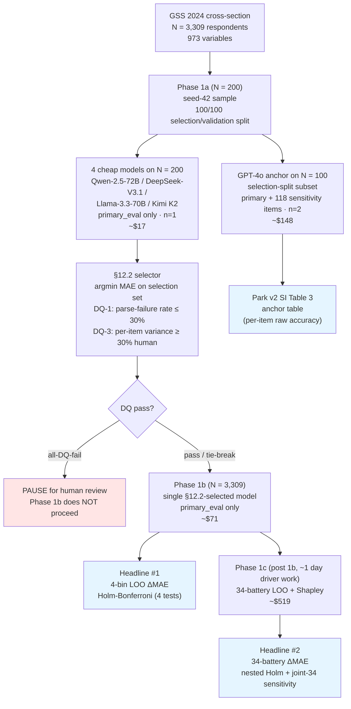
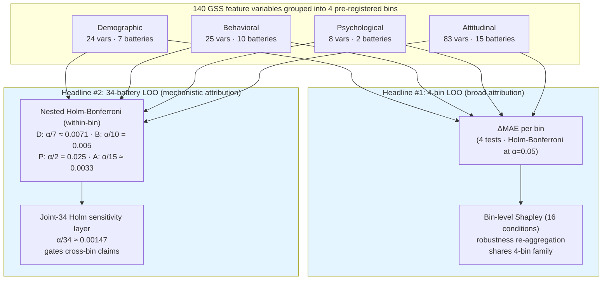

# Project Brief for Professor Bayati — GSBGEN390 Phase 1 OSF Preregistration

**Author**: Joyce Yu
**Advisor**: Professor Mohsen Bayati
**Course**: GSBGEN390 thesis-track research, Stanford Graduate School of Business, Spring 2026
**Date prepared**: 2026-05-10
**Repository**: `github.com/Joyceqx/gsbgen390-persona-pipeline` (current pre-lock commit `16a1c04`)
**Purpose of this document**: Brief Professor Bayati on the Phase 1 research design and preregistration, request final advisor signoff on OSF v1.

---

## Abstract

This document summarizes the Phase 1 preregistration for *Feature Attribution for LLM Persona Synthesis*, an empirical study estimating which of four pre-specified survey-collectible feature categories — demographic, behavioral, psychological, attitudinal — most contributes to large language model (LLM) prediction of held-out attitude outcomes in a U.S. adult sample. Using the General Social Survey (GSS) 2024 cross-section (N=3,309), the design implements leakage-clean, multi-model evaluation of LLM persona-prediction accuracy, with two co-primary analyses at hierarchical resolutions: a four-bin leave-one-out (LOO) ablation that estimates broad feature-category contribution, and a 34-battery LOO with nested Holm-Bonferroni correction that estimates construct-level mechanistic contribution. Phase 1 is the first piece of a multi-phase program that will subsequently extend to BFI personality and behavioral-game outcomes in a Phase 2 collection. The OSF v1 preregistration is drafted; six of seven §17 decision items are resolved by author or by independent citation verification; one remaining item — final advisor signoff — is the subject of this brief.

### Study at a glance

*Total Phase 1 budget: approximately $756 (the figure assumes no prompt caching).*

---

## 1. Significance and contribution

LLM persona simulation — the practice of prompting a language model to respond as a specific human individual — is increasingly deployed in survey simulation, agent-based modeling, in-silico randomized controlled trials, and commercial synthetic-respondent panels. The most-cited prior work, *Generative Agent Simulations of 1,000 People* (Park, Bernstein, Liang et al. 2024, arXiv:2411.10109), reports aggregate fidelity numbers across condition pairs (interview vs. surveys), but does not decompose contribution across **categories of input features** or **specific construct-level batteries**. The dominant open question — *which kinds of survey-collectible information actually drive LLM persona prediction accuracy, and how does that contribution vary across outcome dimensions* — remains underspecified in the existing literature.

Phase 1 contributes four pieces:

1. A **leakage-clean attribution framework** for LLM persona prediction of single-wave survey attitudes, with two layered leakage defenses: structural battery-level exclusion (R1, mirroring Park et al. 2024 SI §6) and a non-LLM regression baseline (R2) on the same R1-respecting input pool.
2. A **two-level hierarchical attribution methodology**: broad feature-category attribution (4-bin LOO) and mechanistic construct-level attribution (34-battery LOO), with nested Holm-Bonferroni multiplicity correction at both levels and a joint-34 Holm sensitivity layer gating cross-bin claims.
3. A **quality-primary multi-model selection rule (§12.2)** with pre-registered disqualification gates (parse-failure ceiling, mode-collapse guard) and a 100/100 selection/validation split that provides a held-out post-selection-inference defense for the Phase 1b headline.
4. An **explicit anti-HARKing commitment**: theory interpretation is Discussion-section only; null or mixed alignment with candidate cognitive frameworks is published with equal prominence to positive alignment, and no hard numeric supports/refutes thresholds are imposed.

The contribution is positioned as a methodological paper that anchors against Park et al. 2024 via a GPT-4o anchor subset (per-item raw-accuracy comparison with Park v2 SI Table 3), while the research question — feature attribution in persona prediction — stands independently of Park's framework.

---

## 2. Research question and estimand

**Phase 1 research question.** Within attitude prediction (single-wave snapshot setting), which of four survey-collectible feature categories — demographic, behavioral, psychological, attitudinal — most contributes to LLM persona prediction of held-out attitudinal items, and within each pre-registered bin, which construct-level batteries drive the predictive signal?

**Project-level question** (extending across phases). In LLM persona synthesis, which input feature categories drive prediction quality, and how does that contribution vary across outcome dimensions? Phase 1 answers this for the attitude outcome dimension; Phase 2 (separate preregistration) will extend to personality (BFI-44) and behavioral economic games through targeted collection.

**Estimand.** Phase 1 estimates single-wave GSS 2024 prediction of held-out attitudinal items (12 `primary_eval` items used for the headline; 118 `sensitivity_eval` items used only on the GPT-4o anchor for cross-paper benchmarking) **from same-wave GSS feature variables**, decomposed into the contribution of four pre-registered feature categories and, within each bin, 34 construct-level batteries.

This is explicitly NOT: test-retest prediction (no GSS recontact baseline available); longitudinal or cross-wave prediction (no panel structure used); normalized persona fidelity (no test-retest denominator); a claim about general human-simulation ability; population inference about U.S. adult attitudes.

**Inferential frame.** The bootstrap is paired-respondent-level (B=10,000, BCa via `scipy.stats.bootstrap` with percentile fallback for degenerate inputs). GSS 2024 is a multi-stage probability sample; the inferential frame is explicitly restricted to the GSS-2024 cross-section as a fixed dataset, NOT population-level parameters of the U.S. adult attitude landscape. A weighted / cluster-bootstrap reanalysis using `WTSSALL` weights is reserved as a future-work robustness column.

---

## 3. Research design

### 3.1 Data and sampling

The full GSS 2024 cross-section (N=3,309 respondents × 973 unique variables, three-batch fixed-width extract from the GSS Data Explorer) is used in its entirety in Phase 1b — i.e., no within-survey sampling. Phase 1a (model selection) uses N=200 respondents drawn deterministically by `sample_respondents(n=200, seed=42)`, split into a selection set (the first 100 in seed-42 order) and a held-out validation set (the next 100). The §12.2 selector scores only on the selection set; the validation set is held out from selection entirely and yields a `validation_mae` reported alongside the Phase 1b headline as a pre-registered post-selection-inference defense.

### 3.2 Evaluation set

- **Primary**: 12 GSS attitudinal items locked in `gss_feature_taxonomy.json` v0.3. These are the headline-eval items used by the §12.2 selector, the 4-bin LOO, the 34-battery LOO, and the Phase 1b N=3,309 headline.
- **Sensitivity**: 118 items used only on the GPT-4o anchor (N=100 selection subset, n_samples=2) for per-item raw-accuracy comparison with Park et al. 2024 SI Table 3. The sensitivity-eval set is the Park-comparable subset (Park's GSS list minus 15 items retired or renamed in 2024) and is anchor-only by design; the cheap panel runs primary-eval only.

### 3.3 Feature taxonomy

The four feature bins (locked in `gss_feature_taxonomy.json` v0.3) contain 140 GSS variables: 24 demographic, 25 behavioral, 8 psychological, 83 attitudinal. The taxonomy was constructed prior to Phase 1a and its SHA-256 hash is recorded in OSF §0; any post-lock change requires a logged OSF amendment.

### 3.4 Battery map

Within each bin, variables are clustered into 34 construct-level batteries plus 17 singletons (locked in `gss_battery_map.json` v0.2). A battery groups variables that measure the same underlying construct closely enough that the battery must be dropped together in leave-one-out analyses — otherwise residual same-construct siblings fill the signal back in and undercount the construct's contribution. The split criterion is: when sub-construct, target group, time point, or response scale differs sufficiently to conflate distinct signals.

### 3.5 Leakage hygiene

Two layered defenses guard against direct prediction-by-redundancy:

**R1 (battery-level structural exclusion).** When predicting any `primary_eval` item, the entire battery containing that item is dropped from the persona prompt. This mirrors Park et al. 2024 SI §6's BFI whole-trait-block hold-out applied to GSS — when predicting `ABANY` (abortion attitude), the entire abortion-attitudes battery (`ABDEFECT`, `ABNOMORE`, `ABRAPE`, …) is removed from the persona's input features. The bin-level contribution attributed to "attitudinal" is therefore cross-construct attitudinal information, not within-construct auto-correlation. R1 is implemented in `run_primary_one_respondent` and validated by `validate_taxonomy.py` check 7c.

**R2 (regression-baseline comparator).** Alongside the LLM panel, a non-LLM regression baseline (Ridge for Likert items, multinomial Logistic for categorical items, 5-fold CV at respondent level, applying R1 symmetrically) is run on the same R1-respecting input pool. The regression's per-item MAE estimates the upper bound on what any non-LLM predictor can extract from the same input. This is framed as a rhetorical decomposition with explicit asymmetric-missing-data caveat — NOT as a literal causal partition. The LLM-vs-regression gap is evidence of model-specific predictive value beyond a simple supervised baseline, not proof of human-like reasoning.

### 3.6 LLM panel + §12.2 quality-primary selector

Phase 1a runs four cheap OpenRouter models on N=200 primary-eval items at temperature 0.7, n_samples=1: Qwen-2.5-72B-Instruct (Alibaba), DeepSeek-V3.1 (DeepSeek), Llama-3.3-70B-Instruct (Meta), and Kimi K2 (Moonshot). The panel composition is three China-trained models plus one Western-trained model (Llama, swapped in pre-OSF to introduce cross-family balance and defend against the "all-China-trained" generalization critique at Western venues).

A GPT-4o anchor runs on the N=100 selection-split subset at n_samples=2 with primary + sensitivity items — the only Park-comparable run, producing the per-item raw-accuracy anchor table side-by-side with Park 2024 SI Table 3. One anchor invocation serves both Phase 1a and Phase 1b reporting purposes.

The **§12.2 selector** chooses the single cheap model for Phase 1b deterministically by minimum respondent-macro Likert MAE on the selection split (the first 100 of the N=200), subject to pre-registered disqualification gates:

- **DQ-1**: parse-failure rate > 30% → disqualify (operationally unusable at scale regardless of measured MAE on the parsed remainder).
- **DQ-3**: per-item output-code population variance < 30% of the human variance on that item for ≥ 50% of `primary_eval` items → disqualify (mode-collapse guard; an absolute threshold is too lenient on heavily-skewed items, so the threshold is relative to the empirical per-item human variance from GSS 2024).

Cost serves as a within-5% tie-break (lowest `cost_per_call × (1 + parse_failure_rate)` among models within 5% of the best MAE). Qwen-2.5-72B-Instruct is the named tie-break-only fallback (fires only when ≥ 2 candidates tie on both quality and cost). **All-DQ-fail returns a pause-for-review verdict and Phase 1b does NOT proceed** — this replaces an earlier draft's Qwen-fallback-on-all-DQ-fail rule, which was removed after audit review because it bypasses the quality gate and would waste paid Phase 1b spend on a failed model.

The selected model's MAE on the held-out N=100 validation split is reported alongside the Phase 1b headline as a pre-registered post-selection-inference defense.

### 3.7 Two co-primary analyses

Phase 1 reports two co-primary results at distinct hierarchical resolutions:

**Headline #1: 4-bin LOO (broad feature-category attribution).** For each of four feature bins, drop the entire bin from the persona prompt; compute respondent-macro Likert ΔMAE relative to the Full condition. Apply Holm-Bonferroni primary correction at α=0.05 within the four-bin family. Bin-level Shapley decomposition (16 conditions enumerated on the Phase 1a panel) serves as a robustness re-aggregation of the same 4-bin estimand and shares the 4-bin primary family — no separate multiplicity correction.

**Headline #2: 34-battery LOO (mechanistic construct-level attribution).** For each of 34 construct-level batteries across all four bins, drop the entire battery from the persona prompt; compute respondent-macro Likert ΔMAE relative to the Full condition. Apply two Holm corrections in parallel:

- **Nested Holm-Bonferroni primary**: one Holm family per bin, applied independently (Demographic: 7 tests, threshold p < α/7 ≈ 0.0071; Behavioral: 10 tests, p < 0.005; Psychological: 2 tests, p < 0.025; Attitudinal: 15 tests, p < 0.0033). Within-bin claims (e.g., "abortion is the strongest battery in the attitudinal bin") use nested Holm only — confirmatory within-bin.
- **Joint-34 Holm sensitivity layer**: every battery is additionally tested against a joint Holm-Bonferroni at α=0.05 across all 34 batteries (threshold p < α/34 ≈ 0.00147). This stricter correction gates cross-bin claims (e.g., "abortion is the strongest battery overall, ahead of subjective_wellbeing"); without joint-34 support, cross-bin rankings are descriptive only and the paper uses "rank-ordered" rather than "significantly stronger than" language.

Battery LOO is co-primary by design and runs by default in Phase 1c, regardless of which bin dominates the 4-bin LOO. Skip / scale-back conditions are limited to: all four bins near-zero ΔMAE (Phase 1 underpowered — investigate before further spend), methodological problem exposed by Phase 1b (parse-failure spike, R1 leakage suspected — fix first), or budget pressure (use documented reduction options).

The hierarchical structure of the two co-primary analyses is illustrated below.

*Two parallel headline outputs at hierarchical resolutions: bin-level (the 4-bin contest) and battery-level (which constructs within each bin do the work). Within-bin battery claims require only the nested Holm primary; cross-bin battery claims require additional joint-34 Holm sensitivity support.*

### 3.8 Statistical infrastructure

- **Aggregation**: respondent-macro-averaged primary metric (each respondent contributes one number per condition/metric; these are averaged). Item-macro and pooled aggregations reported as secondary for transparency.
- **Bootstrap**: B=10,000 paired-respondent-level, BCa via `scipy.stats.bootstrap` with percentile fallback for degenerate inputs. The B=10,000 floor (1/B = 0.0001) is safely below the joint-34 Holm critical p (α/34 ≈ 0.00147).
- **LOO ΔMAE**: paired bootstrap — in each replicate, draw one respondent set with replacement, compute Full and LOO MAE on the same resample, then take the delta. Mathematically equivalent to bootstrapping per-respondent deltas.
- **Effect-size thresholds**: small <0.02 / modest 0.02–0.05 / substantive ≥0.05 ΔMAE on a Likert scale, inspired by Funder & Ozer (2019) effect-size taxonomy. A finding is reported as substantively meaningful only if (a) Holm-significant within its family AND (b) practical-effect ≥ "modest" with bootstrap CI excluding the small-effect boundary. Statistical significance alone is not sufficient for headline-strength substantive interpretation.

### 3.9 Theory interpretation (Discussion-section only)

Six candidate cognitive/value frameworks are pre-specified for Discussion-section interpretive scaffolding: Moral Foundations Theory (Haidt and Graham); Schwartz Theory of Basic Values; Bourdieu cultural / economic capital theory; Cultural Theory (Douglas, Wildavsky); the Inglehart-Welzel cultural map (World Values Survey, Inglehart and Welzel 2005, with individual-level applications per Welzel 2013); and the Big Five personality framework.

Theory framings — positive, mixed, or null alignment — are explicitly NOT confirmatory primary findings. The pre-registered commitment, locked in OSF §17 item ②, is that null or mixed theoretical alignment is published with equal prominence to a positive-alignment finding. No hard numeric supports/refutes thresholds are imposed; the 4-bin and 34-battery results are descriptive inputs to a qualitative theoretical evaluation, not a confirmatory voting procedure. The Discussion section follows a data-organized structure (one subsection per empirical finding, with theory frames as interpretive scaffolding within each), not a theory-organized structure.

Inglehart-Welzel citations were independently verified against publisher records (Cambridge University Press, Princeton University Press), the World Values Survey publications, and secondary literature on 2026-05-10. One additional methodological caveat surfaced during verification — the Beugelsdijk and Welzel (2010) finding that the two-factor structure is only weakly justified at the individual-level — has been added to the theory review §2.2 risks section.

---

## 4. Progress to date

### 4.1 Codebase

| Component | Status |
|---|---|
| GSS loader + taxonomy validator | Implemented + tested (10-check validator, all pass) |
| Persona-prompt construction + scoring pipeline | Implemented + tested (Audit A-E + multi-model aggregation) |
| Multi-model LLM router + per-call seed derivation (SHA-256 over `rid`, `condition`, `item_id`, `model`, `sample_idx`) | Implemented + tested |
| §12.2 selector with 100/100 split, all-DQ-fail pause, Qwen tie-break-only fallback | Implemented + tested (7-branch synthetic-fixture self-test) |
| R2 regression baseline (Ridge + multinomial Logistic, 5-fold CV) | Implemented + tested (12/12 items, warning-free) |
| Battery LOO analyzer (BCa + nested Holm + joint-34 + effect-size labeling + n_paired ≥ 30 floor) | Implemented + tested (8-assertion self-test) |
| Bin-level Shapley decomposition analyzer | Implemented + tested (8-assertion self-test) |
| §11.1 forbidden-language linter for paper drafts | Implemented + tested (5-phase self-test, zero violations on canonical files) |
| Driver named modes (`--phase1a` / `--phase1b` / `--phase1b-anchor`) with F9 cost guard and partial-resume guard | Implemented + tested |
| Phase 1c orchestration drivers (Battery LOO + Shapley `gss_driver.py` modes) | NOT yet implemented; deferred per OSF §13.2 lock-first defense; orchestration to be added before Phase 1c paid run |

### 4.2 Documentation

| Document | Status |
|---|---|
| `gss_phase1_design.md` (canonical live design) | Locked 2026-05-10 |
| `osf_preregistration_v1.md` (OSF v1 draft) | Locked except external faculty signoff |
| `tier1_tool_schemas.md` (analyzer + orchestration spec) | Locked |
| `theory_interpretation_guide.md` + `theory_review_round2.md` | Locked; Inglehart-Welzel citations verified |
| `RUNBOOK.md` (paid-run sequence with step-by-step commands, expected outputs, cost projection) | Drafted |
| OSF platform registration | Pending (will be filed on osf.io after faculty signoff) |

### 4.3 External methodological review

The design has absorbed approximately six rounds of independent statistical and methodological audit since the initial draft. Material design changes implemented in response:

- Phase 1a sample size: N=100 → N=200 with a pre-registered 100/100 selection/validation split (post-selection-inference defense, response to external review of the §12.2 selector).
- Phase 1b sample size: N=1,500 → N=3,309 (full cross-section; removes "sampled to a budget" framing).
- Cheap panel composition: a previously all-China-trained panel (Qwen / DeepSeek / MiniMax / Kimi) was rebalanced to three China-trained plus one Western-trained (Qwen / DeepSeek / Llama-3.3 / Kimi) by replacing MiniMax-M1 with Llama-3.3-70B-Instruct.
- Sensitivity scope: previously inconsistent across documents; now anchored only on GPT-4o per OSF §3.2 — the Park-comparable run is the only intended use of the 118 sensitivity items.
- Bootstrap: B=1,000 percentile → B=10,000 BCa with percentile fallback. The B=1,000 percentile floor of 0.001 collided with the joint-34 Holm critical p of 0.00147; B=10,000 puts the floor safely below.
- §12.2 all-DQ-fail handling: previously a Qwen-fallback rule, now a pause-for-review verdict.
- Per-call seed: previously a hardcoded constant, now a SHA-256-derived value over the call signature (necessary because n_samples=2 self-consistency would otherwise collapse to deterministic identity).
- Sensitivity-pass resume: a data-loss bug in the records-merge path was identified and fixed (deep-merge upsert plus pre-population from existing partials).
- Theory framework null-commitment: hard numeric supports/refutes thresholds (originally "≥ 3 of 4-bin or ≥ 10 of 34-battery") were removed in favor of qualitative judgment criteria, with explicit Discussion-only framing.
- Cost guards: a panel-wide-large-N guard (refuses N ≥ 1,000 multi-model + sensitivity invocations unless explicitly bypassed) and a partial-resume guard (refuses to silently resume from suspiciously small artifacts) were added to prevent operational accidents at paid-run time.

### 4.4 Key methodological decisions

| Decision | Resolution | Rationale |
|---|---|---|
| Phase 1a structure | N=200 with 100/100 selection/validation split | Held-out validation MAE provides a pre-registered rebuttal to the post-selection-inference attack on the Phase 1b headline |
| Phase 1b sample size | N=3,309 (full GSS 2024) | "We used all available data" framing; ~$114 incremental cost over N=1,500; no power calculation needed |
| Cheap panel composition | 3 China-trained + 1 Western-trained (Qwen / DeepSeek / Llama-3.3 / Kimi) | Defends cross-family generalization claims at Western venues; preserves cost efficiency |
| Sensitivity scope | Anchor-only (GPT-4o, N=100, primary + sensitivity, n=2) | Matches OSF §3.2 literal wording; cheap panel sensitivity adds no headline value; saves approximately $120 net in budget |
| All-DQ-fail behavior | Pause for human review (no Qwen fallback) | Bypassing the quality gate to a named fallback wastes paid spend on a model that already failed quality checks |
| Theory interpretation scope | Discussion-only, equal prominence to null / mixed alignment, no numeric thresholds | Anti-HARKing commitment; allows null result publication; prevents post-hoc theory-fitting |
| Battery LOO scientific status | Co-primary by design; unconditional run by default | Mechanistic complement to 4-bin LOO; scientifically valuable regardless of which bin dominates Phase 1b |
| Phase 1c orchestration timing | Implement after Phase 1b results land | Avoids wasting ~1 day of driver work if Phase 1b reveals a methodological issue worth fixing first; not contingent on which bin wins |

---

## 5. Budget

| Sub-phase | Operation | Estimated cost |
|---|---|---|
| Smoke | N=10 cheap × primary only (plumbing verification) | ~$1 |
| Phase 1a cheap panel | N=200 × 4 cheap models × 60 primary prompts/respondent | ~$17 |
| Phase 1b cheap | N=3,309 × 1 §12.2-selected model × 60 primary prompts/respondent | ~$71 |
| GPT-4o anchor | N=100 × 178 prompts × n_samples=2 (single run, serves both Phase 1a and Phase 1b reporting) | ~$148 |
| **Core Phase 1 subtotal (pre-Battery LOO)** | | **~$237** |
| Battery LOO co-primary | 34 batteries × 12 items × N=3,309 × 1 model × 1 sample | ~$481 |
| Shapley 16-condition extension | 11 multi-bin LOO × 12 items × N=200 × 4 cheap models | ~$38 |
| **Total Phase 1** | | **~$756** |

Cost rates: cheap models approximately $0.000356/call (OpenRouter mid-2026 snapshot); GPT-4o approximately $0.00417/call. The budget assumes no prompt caching and is conditioned on OpenRouter price verification at smoke-test time. The author is in a position to absorb modest expansion (for example, reverting to a $875 plan that includes cheap-panel sensitivity) at faculty discretion.

Reduction options remain pre-registered should they be needed: Battery LOO at N=1,500 subsample (saves approximately $263); attitudinal-bin batteries only (15 of 34; saves approximately $209); or defer Battery LOO to Phase 1d after Phase 1b headline justifies the spend.

---

## 6. Current status and decision request

OSF v1 §17 lists seven decision items that must be resolved before the preregistration is filed on the OSF platform. Six items have been resolved by author decision or by independent citation verification; one — final advisor signoff — is the external dependency that this brief requests.

| § | Item | Status | Advisor action requested |
|---|---|---|---|
| ① | Six-framework candidate list (MFT / Schwartz / Bourdieu / Cultural Theory / Inglehart-Welzel / Big Five) | Author-locked 2026-05-10 | Confirm |
| ② | Null-alignment commitment text (Discussion-only, equal prominence) | Author-locked 2026-05-10 | Confirm |
| ③ | Discussion section structure (data-organized) | Author-locked 2026-05-10 | Confirm |
| ④ | Inglehart-Welzel citation verification | Independently verified 2026-05-10 against Cambridge UP, Princeton UP, World Values Survey | Confirm |
| ⑤ | Phase 1c orchestration timing (post Phase 1b; Phase 1c is co-primary by default) | Author-locked 2026-05-10 | Confirm |
| ⑥ | **Faculty final signoff on OSF v1** | **Pending** | **Faculty signoff requested** |
| ⑦ | Phase 1 budget approval (~$756) | Author-locked 2026-05-10 | Confirm |

After faculty signoff is received, the OSF v1 preregistration is filed officially on the OSF platform and assigned a DOI; Phase 1a paid runs are then cleared to begin per the canonical sequence in `RUNBOOK.md`.

---

## 7. Supporting documents

All canonical materials are committed to the project Git repository at `github.com/Joyceqx/gsbgen390-persona-pipeline` (pre-lock commit `16a1c04`). Recommended reading order:

| Document | Purpose | Approximate reading time |
|---|---|---|
| This brief (`Project Brief for Professor Bayati.md`) | Overview, status, decision request | 15 min |
| `osf_preregistration_v1.md` | The complete OSF v1 preregistration (the document for advisor signoff) | 30-45 min |
| `gss_phase1_design.md` | Canonical live design document (source of the OSF) | 30 min |
| `RUNBOOK.md` | Paid-run sequence with exact commands and per-step cost projection | 10 min |
| `tier1_tool_schemas.md` | Battery LOO + Shapley analyzer / orchestration specification | 10 min |
| `theory_review_round2.md` §2 | Theory framework comparison with verified citations and individual-level-applicability discussion | 20 min |

All files render directly in the GitHub repository browser; no separate PDF distribution is required.

---

*Document prepared 2026-05-10 in support of OSF §17 item ⑥ (faculty final signoff). Author: Joyce Yu; advisor: Professor Mohsen Bayati.*
