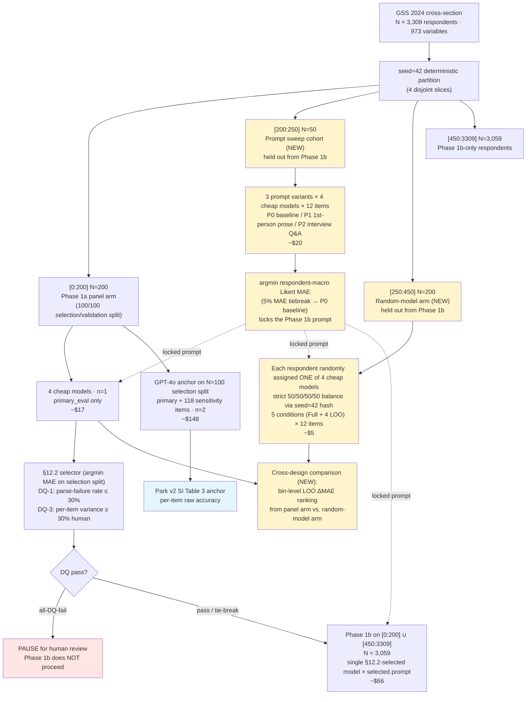

# Project Brief for Professor Bayati — Phase 1A Design Updates

**Author**: Joyce Yu
**Advisor**: Professor Mohsen Bayati
**Course**: GSBGEN390 thesis-track research, Stanford Graduate School of Business, Spring 2026
**Date prepared**: 2026-05-15
**Repository**: `github.com/Joyceqx/gsbgen390-persona-pipeline` (working branch `mohsen-redesign`)
**Snapshot before changes**: tag `pre-mohsen-redesign-2026-05-13` (recoverable rollback point)
**Purpose**: Propose two additions inside Phase 1A (model + prompt selection) following our 5/13 discussion, with a worked end-to-end example and a self-contained walkthrough of the disqualification framework. The Phase 1B headline analysis methodology, the GPT-4o anchor, and the Phase 1c co-primary plan are all unchanged in design; only the Phase 1B sample size is reduced by 250 (the prompt-sweep + random-model-arm holdouts).

---

## 0. Summary

Two additions inside Phase 1A:

1. **NEW — Prompt sweep**: select the Phase 1B prompt empirically from three literature-grounded candidates rather than ship the un-ablated baseline. Uses N=50 respondents held out from Phase 1B.

2. **NEW — Random-model arm**: a separate N=200 cohort, each respondent randomly assigned exactly one of the four cheap models (strict 50/50/50/50 balance). Provides a **genuine between-respondent estimate** of feature-category contribution alongside the panel arm's within-respondent estimate; verifies that §12.2's model selection is not an artifact of the within-respondent panel design. Held out from Phase 1B.

Phase 1B's headline sample reduces from N=3,309 to **N=3,059** (the 250-respondent reduction is the sweep + random-arm holdouts; ~7.5% of N, statistically negligible).

To make the abstract pipeline concrete, §3 of this brief walks through one real GSS 2024 respondent end-to-end (the input data we have on her, the synthesized persona prompt, an example primary_eval question, and how scoring works). §4 explains the disqualification framework you asked us to revisit on 5/13.

Incremental Phase 1A cost: **+$25** (prompt sweep ~$20 + random arm ~$5). Total Phase 1 budget remains within the original ~$756 envelope.

---

## 1. Updated Phase 1A flow diagram

Yellow blocks are new this round. Phase 1B run on the right is unchanged in methodology; only its sample size shrinks by 250 (the two holdouts).



---

## 2. Block-by-block explanation

### 2.1 GSS 2024 seed=42 partition (UPDATED — 4 slices)

The GSS 2024 cross-section (N=3,309) is shuffled once by `sample_respondents(n=3309, seed=42)` and partitioned into **four disjoint slices**:

| Slice | N | Used in Phase 1A | Used in Phase 1B headline |
|---|---|---|---|
| `[0:200]` | 200 | yes (panel arm, all 4 models) | yes (single selected model) |
| `[200:250]` | 50 | yes (prompt sweep) | **no — held out** |
| `[250:450]` | 200 | yes (random-model arm, 1 model each) | **no — held out** |
| `[450:3309]` | 3,059 | no | yes (single selected model) |

Phase 1B's headline sample is `[0:200] ∪ [450:3309]` = **N = 3,059**.

**Why the prompt sweep and the random-model arm must both be held out from Phase 1B**. Both choose or test something on a cohort, and re-using those respondents in Phase 1B would bias the headline:

- The sweep cohort's MAE is what the sweep optimizes over → re-using those 50 in Phase 1B biases the Phase 1B MAE downward on those respondents (selection on the outcome).
- The random-arm cohort's data is what validates §12.2's model choice → if §12.2's robustness check used those 200 to confirm the choice, then re-using them in the Phase 1B headline creates a subtle dependency between the validation and the headline. Carving them out keeps the headline statistically independent of the Phase 1A validation steps.

The cost of the carve-out is a 7.5% reduction in Phase 1B N (3,309 → 3,059). CI on the headline widens by approximately 4%; statistical power on the 4-bin LOO is unchanged at any practically meaningful effect size.

### 2.2 Prompt sweep [200:250] (NEW)

A held-out N=50 cohort is used to choose the Phase 1B prompt empirically from a literature-grounded candidate set rather than shipping the locked baseline.

**Why this addresses your 5/13 suggestion**: you asked whether we could be more careful in selecting the prompt for the upcoming research; this is the operationalization.

**What gets swept**: three prompt variants (see §5.2 for full text and literature grounding) run on the 50 sweep respondents × 12 primary_eval items × 4 cheap models. The candidate that achieves the lowest respondent-macro Likert MAE is locked, then used by the Phase 1A panel arm, the Phase 1A random-model arm, and the Phase 1B headline run.

**Cost**: ~$20 (~4,800 LLM calls at ~$0.0004/call).

### 2.3 Phase 1a panel arm [0:200] (UNCHANGED)

The locked design from OSF v1 — 4 cheap models (Qwen-2.5-72B / DeepSeek-V3.1 / Llama-3.3-70B / Kimi K2) × N=200 × n_samples=1, 100/100 selection/validation split, primary_eval only.

The only change is that this arm now uses the prompt chosen by the prompt sweep (§2.2), not the un-ablated baseline.

The GPT-4o anchor sub-arm on the N=100 selection split is also unchanged; it remains the Park-comparable per-item raw-accuracy table input.

### 2.4 Random-model arm [250:450] (NEW)

A separate cohort of N=200 respondents, each randomly assigned **exactly one** of the four cheap models via a seed=42 hash that produces a strict 50/50/50/50 balance (50 respondents per model). Each assigned respondent runs the same primary_eval LOO conditions as the panel arm (Full + 4 single-bin LOO) under the **locked sweep-winner prompt**.

**Why this exists** (the scientific case):

> The panel arm has every respondent rated by all 4 models — a within-respondent design. Estimates of cross-model agreement and bin-level LOO ΔMAE rankings derived from this arm are partially conditioned on within-respondent dependence: if respondent #17 is hard to predict, all 4 models will be wrong in the same direction on that person, and the cross-model agreement metric is inflated by this shared respondent-level idiosyncrasy.
>
> A reviewer attack: *"Your panel-design cross-model agreement is partly an artifact of every model seeing the same demographic anchor for each person. This does not establish model-level robustness, and the bin-level LOO ranking may not survive deployment, where each user is served by a single model."*
>
> The between-respondent random-model arm directly rebuts this. If the §12.2-selected model and the bin-level LOO ΔMAE ranking from the panel arm agree with the same quantities computed on the random-model arm (a genuinely independent between-respondent estimate), the cross-model robustness story is established on two independent designs, not one.

**Why a new N=200 cohort rather than re-sampling from the panel data**: this is the question of whether the random arm is a real experiment or a post-hoc re-aggregation. Subsampling from the panel re-uses respondents who *did* see all 4 models — the "what if each respondent had seen only one model?" counterfactual cannot be reconstructed from data where they saw all four. A real between-respondent estimate requires real respondents who only ever see one (randomly assigned) model. Hence the new cohort.

**Cost**: ~$5 (N=200 × 1 model × 5 conditions × 12 items ≈ 12,000 calls).

**What this arm produces**:

- A per-model MAE on the random-arm subsample (each model has ~50 respondents) — comparable to the panel arm's per-model MAE.
- A bin-level LOO ΔMAE per bin, aggregated across the four models (between-respondent estimate of feature-category contribution).

### 2.5 §12.2 selector + DQ gates (UNCHANGED)

The selector logic is exactly as locked in OSF v1: argmin respondent-macro Likert MAE on the selection split of the panel arm, with DQ-1 (parse-fail ≤ 30%), DQ-3 (per-item variance ≥ 30% × human variance for ≥ 50% of items), cost as 5% tiebreak, Qwen tie-break-only fallback, and all-DQ-fail PAUSE. **Detailed walkthrough of the disqualification framework — what DQ-1 and DQ-3 measure, what failure modes each catches, and a worked numerical example — is in §4.**

### 2.6 Phase 1b on [0:200] ∪ [450:3309] (UNCHANGED design, N reduced by 250)

Single (§12.2-selected model × sweep-selected prompt) on **N=3,059** respondents. Otherwise identical to OSF v1: primary_eval only, n_samples=1, full-condition + 4-bin LOO, atomic-write resume, paired-respondent bootstrap. Headline ΔMAE per bin with Holm-Bonferroni correction is unchanged.

### 2.7 Cross-design comparison (NEW)

After both Phase 1A arms produce their data, **the bin-level 4-LOO ΔMAE ranking is computed twice** — once on the within-respondent panel arm, once on the between-respondent random-model arm — and the two rankings are compared.

**The comparisons we report**:

| Quantity | Panel arm estimate | Random-arm estimate | What agreement tells us |
|---|---|---|---|
| §12.2 selected model | argmin MAE on panel selection split | argmin MAE on random-arm subsample | §12.2's model choice is robust across designs |
| 4-bin LOO ΔMAE ranking | ΔMAE per bin from full-panel 4-LOO | ΔMAE per bin aggregated across the random 50/50/50/50 split | The bin-level attribution survives the deployment-mode design |
| Cross-model agreement (panel only) | % of items where all 4 models agree | n/a (each respondent sees one model) | Panel arm's cross-model agreement is interpreted alongside the random arm's per-model MAEs |

**Status of this comparison**: it is a sensitivity analysis, not a primary inferential test. The Phase 1B headline remains the panel-design 4-bin LOO ΔMAE; the random-arm ranking is reported alongside as a robustness column in the writeup. Disagreement between the two designs is reported transparently and investigated.

---

## 3. Concrete example: one persona prediction end-to-end

To make the abstract pipeline concrete, this section walks through what the system does for **one real GSS 2024 respondent** — the first one drawn by the seed=42 sample (Phase 1a `[0]`). She is a publicly-released GSS respondent with all identifying information already removed by NORC.

### 3.1 The prediction targets — 12 primary_eval items

The headline analysis predicts these 12 attitude items, one per LLM call. They are drawn from each major construct family in the GSS so that the four-bin LOO ablation can detect bin-specific effects.

| Variable | Construct family | Format | Scale |
|---|---|---|---|
| POLVIEWS | political ideology | Likert-7 | 1 = Extremely liberal … 7 = Extremely conservative |
| PARTYID | party identification | Likert-7 + Other | 0 = Strong Democrat … 6 = Strong Republican (7 = Other) |
| ABANY | abortion attitudes | binary | 1 = YES (favor abortion for any reason), 2 = NO |
| CAPPUN | death penalty | binary | 1 = FAVOR, 2 = OPPOSE |
| GUNLAW | gun control | binary | 1 = FAVOR (gun permits), 2 = OPPOSE |
| FECHLD | gender role attitudes | Likert-4 | 1 = Strongly agree (working mother can establish warm relationship with children) … 4 = Strongly disagree |
| FEPOL | women in politics | binary | 1 = AGREE (men better suited emotionally for politics), 2 = DISAGREE |
| RACDIF1 | racial attitudes | binary | 1 = YES (racial inequality is due to discrimination), 2 = NO |
| CONFINAN | institutional confidence (banks) | Likert-3 | 1 = A great deal … 3 = Hardly any |
| CONLEGIS | trust in Congress | Likert-3 | 1 = A great deal … 3 = Hardly any |
| HELPPOOR | economic-policy attitudes | sparse-anchored Likert-5 | 1 = Govt should improve standard of living … 5 = Each person should take care of self |
| SATFIN | financial life-evaluation | Likert-3 | 1 = Pretty well satisfied … 3 = Not at all satisfied |

GSS 2024 uses ballot rotation, so any single respondent typically sees only ~8 of these 12 items. The headline metric (respondent-macro Likert MAE) excludes parse-failed and ballot-missing items per-respondent.

### 3.2 What we have on this respondent (the input)

The respondent the pipeline draws as `seed=42 index 0` is a 24-year-old white female from the South Atlantic region (interviewed in the Northeast). She voted for Biden in 2020. She is never-married, has a Bachelor's degree, works full-time (55 hours/week). She self-identifies as Catholic but is "not religious at all" and attends services less than once a year. She reports being very happy, very satisfied with her work, and finding life exciting.

GSS 2024 measures 140 variables in our taxonomy across her ballot. Organized by the four pre-registered bins (the design's LOO conditions), her substantive responses are:

**Demographic bin** (20 variables filled): age 24, female, white, never-married, Bachelor's, total family income $75-89K, German ancestry, born in US, lived in Midwest at age 16, currently Northeast, both parents had graduate-level education, family income at 16 was "far above average."

**Behavioral bin** (18 variables filled): voted Biden in 2020, ineligible to vote in 2016, works full-time at 55 hours/week, uses computer, watches 2 hours/day of TV, attends religious services less than once a year, never prays, Catholic, raised Catholic, no gun in home, neither she nor partner hunts, reads newspaper every day, would find it "somewhat easy" to find an equally good job if needed.

**Psychological bin** (4 variables filled): general happiness = very happy; health = good; life = exciting; work satisfaction = very satisfied.

**Attitudinal bin** (33 variables filled — excluding the 12 primary_eval targets being predicted): pro-choice on all seven abortion conditions, "strongly disagree" with "better for man to work, woman tend home", "disagree" that preschool kids suffer if mother works, "not wrong at all" on homosexual sex relations, supports increasing immigration, supports more federal spending on childcare / alternative energy / highways / scientific research, supports birth control for teenagers 14-16, believes racial inequality is due to lack of education (not in-born ability or lack of will), supports sex education in public schools, opposes spanking, supports physician-assisted suicide for incurable disease (but not for bankruptcy or being tired of living), considers federal income tax too high, considers sex outside marriage always wrong.

Her ground-truth primary_eval answers (the items the headline will predict) are:

| Variable | Her answer | On her ballot? |
|---|---|---|
| POLVIEWS | Slightly liberal (code 3) | yes |
| PARTYID | Not very strong democrat (code 1) | yes |
| ABANY | YES (code 1) | yes |
| CAPPUN | (not on her ballot) | no |
| GUNLAW | FAVOR (code 1) | yes |
| FECHLD | AGREE (code 2) | yes |
| FEPOL | (not on her ballot) | no |
| RACDIF1 | YES (code 1) | yes |
| CONFINAN | (not on her ballot) | no |
| CONLEGIS | (not on her ballot) | no |
| HELPPOOR | (not on her ballot) | no |
| SATFIN | Pretty well satisfied (code 1) | yes |

The pipeline never sees these primary_eval values during prompt construction (R1 leakage hygiene removes the entire battery containing the item being predicted; see §3.5 leakage notes in the original OSF v1 brief).

### 3.3 The synthesized persona prompt (P0 baseline)

Plugging this respondent's 75 substantive responses across the four bins into `build_persona_prompt()` yields the P0 baseline persona prompt below. This is the **exact string** the LLM sees as the system message; the only modification at inference time is that the entire bin containing the prediction target is dropped (e.g., when predicting POLVIEWS, the attitudinal bin is dropped; she remains as demographic + behavioral + psychological only). The prompt for this respondent is **75 features, ~1,012 tokens**.

```
You are a person who completed the 2024 General Social Survey (GSS). Below is what
you told the survey, organized by topic. Stay in character as this respondent
throughout — your views, your demographics, your behaviors are as described.

You may be asked further survey questions. Answer ENTIRELY IN CHARACTER as this
person, drawing on the consistency of the views and life context shown below.
Always commit to a single answer in the requested format. No "it depends" hedges,
no refusals, no qualifications about being an AI.

## YOUR DEMOGRAPHIC BACKGROUND
- age of respondent: 24
- was r born in this country: YES
- r's highest degree: Bachelor's
- did rs family own or rent home when r was age 16: Owned or was buying
- highest year of school completed: 4 years of college
- country of family origin: Germany
- living with parents when 16 yrs old: Both own parents
- hispanic specified: Not Hispanic
- r's family income when 16 yrs old: FAR ABOVE AVERAGE
- total family income: $75,000 to $89,999
- Mother's highest degree: Graduate
- Highest year school completed, mother: 8 or more years of college
- marital status: Never married
- geographic mobility since age 16: Different state
- Father's highest degree: Graduate
- Highest year school completed, father: 8 or more years of college
- race of respondent: White
- region of residence, age 16: Midwest
- region of interview: Northeast
- respondents sex: FEMALE

## YOUR BEHAVIORS
- how often r attends religious services: Less than once a year
- r use computer: YES
- how fundamentalist is r currently: Moderate
- number of hours worked last week: 55
- does r or spouse or partner hunt: NEITHER HUNTS
- could r find equally good job: Somewhat easy
- is r likely to lose job: Not likely
- how often does r read newspaper: Every day
- have gun in home: NO
- was r's work part-time or full-time?: Full-time
- how often does r pray: Never
- VOTED TRUMP OR BIDEN: Biden
- r's religious preference: Catholic
- religion in which raised: Catholic
- hours per day watching tv: 2
- remember if voted in 2016 election: Ineligible
- REMEMBER IF VOTED IN 2020 ELECTION: Voted
- labor force status: Working full time

## YOUR PSYCHOLOGICAL DISPOSITIONS
- general happiness: Very happy
- condition of health: Good
- is life exciting or dull: Exciting
- work satisfaction: Very satisfied

## YOUR ATTITUDES
- strong chance of serious defect: YES
- woman's health seriously endangered: YES
- married--wants no more children: YES
- low income--cant afford more children: YES
- pregnant as result of rape: YES
- not married: YES
- allow anti-religionist to teach: ALLOWED
- allow racist to teach: ALLOWED
- whites hurt by aff. action: Not very likely
- better for man to work, woman tend home: STRONGLY DISAGREE
- should hire and promote women: NEITHER AGREE NOR DISAGREE
- preschool kids suffer if mother works: DISAGREE
- homosexual sex relations: NOT WRONG AT ALL
- number of immigrants nowadays should be: Increased a little
- assistance for childcare: TOO LITTLE
- developing alternative energy sources: Too little
- highways and bridges: TOO LITTLE
- supporting scientific research: TOO LITTLE
- social security: ABOUT RIGHT
- birth control to teenagers 14-16: STRONGLY AGREE
- differences due to in-born learning ability: NO
- differences due to lack of education: YES
- differences due to lack of will: NO
- has r ever had a 'born again' experience: NO
- r consider self a religious person: Not religious at all
- sex education in public schools: Favor
- favor spanking to discipline child: DISAGREE
- r consider self a spiritual person: Not spiritual at all
- suicide if incurable disease: YES
- suicide if bankrupt: NO
- suicide if tired of living: NO
- r's federal income tax: Too high
- sex with person other than spouse: ALWAYS WRONG

---

You will now be asked one or more additional GSS questions. Answer in character,
in the exact format requested by each question.
```

This is the **Full condition** prompt — all four bins included. For the four-bin LOO conditions:

- **drop_bin = demographic**: remove the entire "## YOUR DEMOGRAPHIC BACKGROUND" section.
- **drop_bin = behavioral**: remove the entire "## YOUR BEHAVIORS" section.
- **drop_bin = psychological**: remove "## YOUR PSYCHOLOGICAL DISPOSITIONS".
- **drop_bin = attitudinal**: remove "## YOUR ATTITUDES".

ΔMAE per bin is computed as `MAE(LOO-bin-dropped) − MAE(Full)`, giving the marginal contribution of that bin to LLM persona prediction.

### 3.4 The item-question prompt (the user message)

After the persona prompt above is set as the system message, each of the 12 primary_eval items becomes its own user message. Three concrete examples:

**Predicting POLVIEWS (Likert-7):**

```
GSS question: think of self as liberal or conservative

Options:
  1. Extremely liberal
  2. Liberal
  3. Slightly liberal
  4. Moderate, middle of the road
  5. Slightly conservative
  6. Conservative
  7. Extremely conservative

Output ONLY a single integer code (1-7).
```

Her ground-truth answer is **3 (Slightly liberal)**. If the LLM outputs `3`, absolute error = 0. If the LLM outputs `5` (Slightly conservative), absolute error = 2. Respondent-macro Likert MAE averages such per-item errors across her Likert items, then averages across all respondents.

**Predicting GUNLAW (binary):**

```
GSS question: favor or oppose gun permits

Options:
  1. FAVOR
  2. OPPOSE

Output ONLY a single integer code (1-2).
```

Her ground-truth answer is **1 (FAVOR)**. For binary items, the headline metric is exact-match accuracy (not MAE), although for selector-scoring purposes (§12.2) MAE is computed on Likert items only.

**Predicting FEPOL (binary, with stem-override):**

```
GSS question: Tell me if you agree or disagree with this statement: "Most men are
better suited emotionally for politics than are most women."

Options:
  1. AGREE
  2. DISAGREE

Output ONLY a single integer code (1-2).
```

FEPOL's canonical GSS variable label ("women not suited for politics") is terse and ambiguous about polarity, so the pipeline overrides four items (FEPOL, FECHLD, RACDIF1, HELPPOOR) with full GSS codebook question wording for clarity.

This respondent is not on the FEPOL ballot in GSS 2024, so the pipeline would skip this item for her at runtime.

### 3.5 Putting it together: the call sequence for this respondent

For every primary_eval item she is on the ballot for, the pipeline issues one LLM call per (model, condition):

```
SYSTEM: [persona prompt with appropriate bin dropped per condition]
USER:   [item-question prompt]
→ LLM   single integer code
→ parse + score against her ground truth
```

For this respondent in the Phase 1a panel arm: 7 primary_eval items on her ballot × 5 conditions (Full + 4 single-bin LOO) × 4 cheap models ≈ **140 LLM calls** for her, plus an additional ~178 calls × n_samples=2 for the GPT-4o anchor (because she is in the N=100 selection split, primary + sensitivity items). The cheap-panel pipeline runs ~50,000 LLM calls across N=200 respondents at ~$0.0004/call ≈ $17.

A respondent assigned to the random-model arm (in slice `[250:450]`) instead sees just one model × 5 conditions × ~7 items on the ballot ≈ 35 calls per respondent.

---

## 4. Disqualification framework — what DQ-1 and DQ-3 are and why they exist

The §12.2 model-selection rule does not just argmin MAE. Before any MAE comparison, each of the four cheap-panel models must pass two pre-registered disqualification (DQ) gates: **DQ-1 (parse-failure ceiling)** and **DQ-3 (mode-collapse guard)**. A model that fails either gate is removed from the candidate pool and cannot be selected for Phase 1B, regardless of its measured MAE.

This section explains what each gate measures, what failure mode it catches, and what happens when all four models fail. The framework is locked in OSF v1 §12.2 and remains unchanged this round; we include it here because you asked us to look more carefully at disqualification, and the clearest answer is a self-contained walkthrough you can review against your concern.

(Historical note: the OSF document numbers these as DQ-1 and DQ-3. An earlier draft of the framework included a DQ-2 — a within-model self-consistency floor — which was removed pre-OSF when the cheap panel moved to `n_samples = 1` and self-consistency was replaced by cross-model agreement as the stability QA metric. The numbering was kept to preserve the audit trail.)

### 4.1 DQ-1 — Parse-failure ceiling

**What it measures.** The fraction of LLM responses across the Phase 1a panel run where the output could not be parsed to a valid integer code matching the item's response options.

```
DQ-1 metric    = (# of parse-fail samples) / (total # of samples)
DQ-1 threshold = 30%
Model passes if parse-failure rate ≤ 30%
```

**Examples of parse failures**:

- Model refuses: *"As an AI assistant, I cannot provide a single answer to this question…"*
- Model hedges instead of committing: *"It depends on the context, but probably 3 or 4…"*
- Model outputs verbose justification instead of just the integer: *"Given this respondent's background, the most likely answer would be a 5 because…"*
- Model returns a code outside the valid range (e.g., outputs "10" when the scale is 1-7)
- Model returns a rate-limit error or API error string

**Why this gate exists**. A model with 30%+ parse failures is operationally unusable at the scale Phase 1B requires. The MAE on its parsed remainder is also unreliable — selection bias guarantees the parsed subset is non-representative, and a model might score well on the easy items it parsed and refuse on the hard ones. The 30% threshold was set pre-OSF after pilot runs; it is loose enough to absorb minor formatting hiccups but tight enough to flag systemic refusal or hedging patterns.

**What we'd see if a model fails**: in the decision log, the model would be tagged `dq1_pass = False`; its row in the per-model table would show `parse_failure_rate > 0.30`; the selector silently skips it and continues to compare among the remaining DQ-passers.

### 4.2 DQ-3 — Mode-collapse guard

**What it measures.** For each of the 12 primary_eval items, the variance of the model's predicted codes across the respondents that saw that item, relative to the variance of the human population's actual GSS 2024 responses on the same item.

```
For each primary_eval item i:
    DQ-3 ratio_i = var(model_predictions_i) / var(human_GSS_2024_responses_i)
    item_i fails the floor if ratio_i < 0.30

Model-level aggregation:
    fail_pct = (# items failing the floor) / (# items with ≥ 1 valid prediction)
    Model passes DQ-3 if fail_pct ≤ 50%
A model with > 50% of items failing the floor is disqualified.
```

**Examples of mode-collapse failures**:

- A model that always outputs "4 (Moderate, middle of the road)" on POLVIEWS for every respondent (variance = 0; humans have variance ≈ 2.3; ratio = 0; fails the floor)
- A model that always outputs the modal answer for every binary item (variance = 0)
- A model that only ever uses codes 3 and 4 on a Likert-7 scale (compressed variance vs. wide human variance)
- A model that has learned a strong prior toward a specific answer and largely ignores the persona prompt

**Concrete numerical example** (using approximate GSS 2024 human variances; the locked reference numbers live in `outputs/primary_eval_human_variance_2024.json`):

Hypothetical "lazy" model that always answers `4` (mode) on Likert items and `1` on binary items, regardless of persona:

| Item | Human variance | "Always answer mode" model variance | Ratio | Item fails floor? |
|---|---|---|---|---|
| POLVIEWS | 2.34 | 0.00 | 0.00 | yes |
| PARTYID | 4.24 | 0.00 | 0.00 | yes |
| ABANY | 0.25 | 0.00 | 0.00 | yes |
| GUNLAW | 0.21 | 0.00 | 0.00 | yes |
| FECHLD | 0.93 | 0.00 | 0.00 | yes |
| FEPOL | 0.15 | 0.00 | 0.00 | yes |
| RACDIF1 | 0.25 | 0.00 | 0.00 | yes |
| CONFINAN | 0.49 | 0.00 | 0.00 | yes |
| CONLEGIS | 0.45 | 0.00 | 0.00 | yes |
| HELPPOOR | 1.78 | 0.00 | 0.00 | yes |
| CAPPUN | 0.21 | 0.00 | 0.00 | yes |
| SATFIN | 0.51 | 0.00 | 0.00 | yes |

12 out of 12 items fail (fail_pct = 100% > 50%) → model **disqualified**.

Now compare with a hypothetical "healthy" model whose predictions span roughly the same range as humans:

| Item | Human variance | Healthy model variance | Ratio | Item fails floor? |
|---|---|---|---|---|
| POLVIEWS | 2.34 | 1.80 | 0.77 | no |
| PARTYID | 4.24 | 3.10 | 0.73 | no |
| ABANY | 0.25 | 0.22 | 0.88 | no |
| GUNLAW | 0.21 | 0.18 | 0.86 | no |
| FECHLD | 0.93 | 0.80 | 0.86 | no |
| FEPOL | 0.15 | 0.13 | 0.87 | no |
| (...) | (...) | (...) | (>0.30) | no |

0 of 12 items fail → model **passes** DQ-3 and proceeds to MAE comparison.

**Why the threshold is per-item relative (not absolute)**. Human variance varies substantially across primary_eval items: FEPOL has variance ≈ 0.15 (heavily skewed binary; ~85% of humans answer DISAGREE), PARTYID has variance ≈ 4.24 (broad spread across the 0-7 Democrat-Republican-Other scale). An absolute threshold like "variance ≥ 0.5" would be too lenient on FEPOL (a model could pass FEPOL by outputting only AGREE or only DISAGREE — both produce variance ≤ 0.25, but the all-DISAGREE model is "lazy", the all-AGREE model isn't representative either) and too strict on PARTYID (a perfectly healthy model with variance 0.8 would fail). The per-item relative threshold scales the floor to each item's human spread, so the gate is comparably strict across items with very different distributions.

**Why the >50% aggregation rule (not "any 1 item")**. GSS ballot rotation means each model only "sees" ~30-65% of respondents on most items, so per-item variance estimates are noisy. A strict "any 1 item fails = disqualify" rule would over-reject models for stochastic per-item noise on small-N items. The 50% aggregation requires a majority of items to fail the floor, which is robust to per-item noise while still flagging systemic mode collapse.

**Why this gate exists at all**. Mode-collapsed models can have surprisingly low MAE on GSS attitude items, because most attitude items cluster centrally and "always 4" gets close to a sizeable fraction of human respondents who actually answered "moderate". Without DQ-3, the §12.2 selector could pick a model whose low MAE is *because* it has stopped trying to predict individual respondents, not because it has learned them. DQ-3 is the explicit anti-cheat: it rejects models that have given up on individuation regardless of their measured MAE.

### 4.3 All-DQ-fail handling: PAUSE for human review

If all four cheap models fail DQ-1 or DQ-3 (the candidate pool after gating is empty), the §12.2 selector returns `selected = None` with rationale `all_dq_fail_pause_for_review`. **Phase 1B does not proceed.**

**Why**. An empty candidate pool is a signal that something structural is wrong — the prompt template is broken, the parser has a bug, the model panel has a systemic issue at the current OpenRouter snapshot, or the locked human-variance reference is misaligned with the data. Silently bypassing the gate to a named fallback would burn ~$66 of paid Phase 1B spend on a model already known to be unreliable. The PAUSE forces human review: diagnose the failure, fix it, and either rerun Phase 1a or file an OSF amendment.

An earlier OSF draft had a Qwen-fallback-on-all-DQ-fail rule; that rule was removed pre-OSF (2026-05-09) after audit review pointed out it bypasses the quality gate. The current locked behavior is PAUSE, not silent override.

### 4.4 Summary — how DQ interacts with the rest of §12.2

The full Phase 1A → Phase 1B selection flow is:

1. Run all 4 cheap models on the panel arm and the GPT-4o anchor.
2. For each cheap model on the selection split (N=100): compute `parse_failure_rate`, per-item variance ratios, and respondent-macro Likert MAE.
3. Apply DQ-1 (parse rate ≤ 30%) and DQ-3 (per-item variance floor, >50% aggregation). Any model failing either gate is removed.
4. If the survivor pool is empty → PAUSE, do not proceed to Phase 1B.
5. Among survivors, take argmin MAE. If two or more models are within 5% of the best MAE, tiebreak on cost score (`cost × (1 + parse_failure_rate)`); if both quality and cost tie within 1%, the named Qwen-2.5-72B-Instruct fallback fires.
6. The selected model's MAE on the held-out validation split (N=100) is also reported alongside the Phase 1B headline as a post-selection-inference defense.
7. The random-model arm (§2.4) independently computes per-model MAE on its N=200 between-respondent cohort; agreement with the panel-arm §12.2 selection is reported alongside the headline as a cross-design robustness column (§2.7).

This sequence is unchanged from OSF v1 except step 7, which is new this round.

---

## 5. Decisions in detail

### 5.1 A1 — Prompt sweep cohort

**Decision**: use GSS 2024 seed=42 indices `[200:250]`, N=50, for the prompt sweep.

**Alternatives considered**:

| Option | Pros | Cons | Verdict |
|---|---|---|---|
| GSS 2022 separate wave (N=50) | Zero overlap with 2024 | Two-year attitude drift (esp. 2024 election); requires loader extension | rejected — leakage already addressed by held-out 2024 |
| **GSS 2024 held-out N=50** | Same attitude distribution as Phase 1b; standard cross-validation | Phase 1b N drops 1.5% | **selected** |
| Use GSS 2024 first 50 respondents | Simplest | Same cohort as Phase 1b headline → severe data peeking | rejected |
| Skip sweep, ship locked baseline | No cost | No empirical defense for prompt choice | rejected |

### 5.2 A2 — Prompt sweep candidates (3-variant 2×2 ablation)

The sweep is a **2×2 ablation** that isolates two design knobs simultaneously: voice (1st person vs. 2nd person) and structure (key-value list vs. interview Q&A turns).

| Candidate | Voice | Structure | Citation grounding |
|---|---|---|---|
| **P0 baseline** | 2nd person | 4-bin key-value list | Park et al. 2024 v2 (arXiv:2411.10109) — the surveys-only condition |
| **P1 Argyle 1st-person prose** | 1st person | 4-bin clauses | Argyle, Busby, Fulda, Gubler, Rytting, Wingate (2023) "Out of One, Many", *Political Analysis* 31(3) |
| **P2 Wang interview Q&A** | 2nd person (dialogue) | 4-bin Q-A turns | Wang, Pyatkin, Bhagavatula, Choi (2025) "The Prompt Makes the Person(a)", *Findings of EMNLP 2025* |

**Why these three (and not others)**.

P0 must be in the sweep — it is the citation baseline against Park 2024 (see §3.3 above for the exact P0 string).

P2 must be in the sweep — Wang et al. 2025 is the only paper in the persona-simulation literature with a **direct head-to-head ablation** of prompt format (3 role-adoption × 3 priming strategies × 5 LLMs × 15 demographic groups × 100 OpinionQA items). Their winner was interview Q&A with name-based priming; this is the strongest empirical signal in the field on prompt-form design.

P1 fills a **genuine literature gap**. Argyle 2023 uses 1st-person prose; Park / Hu / Bisbee / our baseline use 2nd person; no paper has compared them head-to-head on a survey-prediction task. Including P1 turns the sweep into a clean 2×2 (voice × structure) that lets us decompose where any improvement comes from.

**Why not include further variants** (already considered and excluded):

- **Plain chain-of-thought (CoT)**: Sun et al. 2025 ("PB&J: Improving LLM Personas via Rationalization with Psychological Scaffolds", arXiv:2504.17993) show that on OpinionQA with GPT-4, demographics+judgments+CoT achieves 49.17% vs. demographics+judgments alone at 49.63% — i.e., **zero gain from CoT** on this task family.
- **Variable reordering / re-paragraphing within bins**: Hu & Collier 2024 (*ACL 2024*) report "little variation" from reorder / reparagraph ablations on a similar task.
- **PB&J scaffolded rationale**: Sun 2025 shows +4.8 pp on OpinionQA, the strongest single intervention in the literature, but requires an additional LLM pre-pass per respondent to generate the rationale. Excluded under simplicity — better evaluated as a Phase 2 question.
- **Remove "GSS" brand name** (Salecha et al. 2024): a single-knob ablation testing whether naming a recognizable instrument inflates social-desirability bias. Excluded under simplicity unless a fourth slot is wanted.

**Example — what the three prompts look like for the §3 example respondent**.

P0 baseline appears verbatim in §3.3 above.

P1 Argyle 1st-person prose:
```
I am a respondent of the 2024 General Social Survey. Below is who I am, organized
by topic. I will answer further survey questions in character, in the exact format
requested. I will commit to a single answer per question and will not hedge,
refuse, or break character.

## ABOUT ME — DEMOGRAPHICS
I am 24 years old. I am female. I am white. I have never been married. I have a
Bachelor's degree. My total family income is between $75,000 and $89,999. ...

## ABOUT ME — BEHAVIORS
I attend religious services less than once a year. I voted for Biden in 2020. I
work full-time, 55 hours per week. I watch about 2 hours of TV per day. ...

## ABOUT ME — PSYCHOLOGICAL DISPOSITIONS
I am very happy in general. I find life exciting. I am very satisfied with my
work. My health is good.

## ABOUT ME — ATTITUDES
[1st-person clauses for the 33 substantive attitudinal responses ...]
```

P2 Wang interview Q&A:
```
The following is an interview transcript with a respondent of the 2024 General
Social Survey. The respondent answered questions about themselves, their
behaviors, their psychological dispositions, and their attitudes.

You will later be asked to continue answering in the voice of this same
respondent, in the exact format requested. You will commit to a single answer
per question and will not hedge, refuse, or break character.

## DEMOGRAPHIC BACKGROUND
Interviewer: How old are you?
Respondent: I am 24.
Interviewer: What is your sex?
Respondent: Female.
Interviewer: What is your race?
Respondent: White.
Interviewer: What is your marital status?
Respondent: I have never been married.
...

## BEHAVIORS
Interviewer: How often do you attend religious services?
Respondent: Less than once a year.
...
```

All three preserve the 4-bin structure (so the 4-bin LOO is implementable on each), preserve per-item exclusion for AUDIT-D (so the sensitivity_eval per-item hold-out is implementable on each), and produce the same target output format at item-question time.

### 5.3 A3 — How the sweep picks a winner

For each candidate prompt, compute the respondent-macro Likert MAE on the 50 sweep respondents averaged across the 4 cheap models. The candidate with the lowest MAE wins.

If the top-2 candidates fall within 5% of the best MAE (i.e., the difference is in noise range), the winner defaults to P0 baseline. The 5% window matches the §12.2 model-selection tiebreak window in OSF v1 — same rule applied at the prompt level.

**Why MAE and not Park's normalized accuracy**. Park et al. 2024 use normalized accuracy, where the denominator is a 2-week test-retest baseline. GSS 2024 has no recontact and no normalized denominator. OSF v1 §10 already locks raw MAE as the headline metric and explicitly does not directly compare to Park's normalized numbers; the GPT-4o anchor reports per-item raw accuracy side-by-side with Park's SI Table 3 only as a separate sensitivity-analysis comparator. The sweep must use the same metric as the headline.

### 5.4 C1 — Random-model arm sample size and source

**Decision**: N=200 independent respondents drawn from GSS 2024 seed=42 indices `[250:450]`. Each respondent runs under the locked sweep-winner prompt with **one** of the four cheap models (assigned deterministically by seed=42 hash, strict 50/50/50/50 balance — see §5.5).

Alternatives:

| Option | Cost | Per-model N | Verdict |
|---|---|---|---|
| Same 200 respondents as panel; randomly select one of 4 model results per respondent post-hoc | $0 | 50 | rejected — not a valid between-respondent design; the panel respondents *did* see all four models, so the "what if they had only seen one?" counterfactual cannot be reconstructed |
| **Independent N=200 in [250:450]** | ~$5 | 50 | **selected** |
| Independent N=100 in [250:350] | ~$2.50 | 25 | rejected — per-model N too small for stable per-model MAE comparison |
| Independent N=400 | ~$10 | 100 | rejected — marginal power gain over N=200 not worth doubling the carve-out from Phase 1B |

### 5.5 C2 — Random-arm allocation

**Decision**: strict 50/50/50/50 allocation across the 4 cheap models via deterministic seed=42 hash on respondent_id.

Alternative considered: true random (each respondent independently draws one of 4 models uniformly), which yields slightly unbalanced cell sizes (e.g., 47/51/50/52). The strict-balance design has tighter and more comparable per-model CIs, which is the relevant goal here — we are estimating "what does the Phase 1B-mode performance look like when each respondent sees only one model", and balanced cells maximize the power of the cross-arm ranking comparison. The "true random" framing would add the strict random-assignment interpretation usually invoked for causal claims, but the arm's role here is sensitivity, not a randomized trial.

---

## 6. Updated budget

| Sub-phase | Operation | OSF v1 | Proposed | Δ |
|---|---|---|---|---|
| Smoke | N=10 cheap × primary (plumbing) | ~$1 | ~$1 | 0 |
| **Prompt sweep (NEW)** | N=50 × 3 prompts × 4 models × 12 items | — | ~$20 | +20 |
| Phase 1a cheap panel | N=200 × 4 cheap × primary | ~$17 | ~$17 | 0 |
| **Random-model arm (NEW)** | N=200 × 1 model × 5 conditions × 12 items | — | ~$5 | +5 |
| GPT-4o anchor | N=100 × primary + sensitivity × n=2 | ~$148 | ~$148 | 0 |
| Phase 1b cheap (single selected model) | N=3,309 → N=3,059 | ~$71 | ~$66 | −5 |
| **Core Phase 1 subtotal (pre-Battery LOO)** | | **~$237** | **~$257** | **+20** |
| Battery LOO co-primary | 34 batteries × 12 items × N | ~$481 | ~$445 (proportional) | −36 |
| Shapley 16-condition extension | 11 conditions × 12 items × N=200 × 4 cheap | ~$38 | ~$38 | 0 |
| **Total Phase 1** | | **~$756** | **~$740** | **−16** |

Phase 1A net add ~$25; absorbed by the Phase 1B and Battery LOO reductions (Battery LOO scales with N=3,059 rather than N=3,309). Total Phase 1 stays within the original budget envelope.

---

## 7. Questions for your review

1. **Sweep candidates (§5.2)**: are P0 + P1 + P2 the right three to test? Specifically, do you want me to add a fourth candidate — Salecha-style brand-name removal (cheapest add) or PB&J psychological scaffold (most empirically supported but adds a pre-pass)?

2. **Random-model arm size (§5.4)**: is N=200 (50 per model) the right size? If you would prefer a more powered arm (N=400, ~$10, 100 per model) so the cross-design ranking comparison can hit tighter CIs, that is easy to add now and only reduces Phase 1B to N=2,859.

3. **End-to-end example (§3)**: is the level of concreteness here the right pitch, or would you like more / less detail on any block? I can extend the example to show one specific LLM call (system message + user message + actual model output + score) if it helps.

4. **Disqualification framework (§4)**: does the variance-ratio DQ-3 rule address what you had in mind when you suggested checking the disqualification logic more carefully, or were you pointing at a different dimension (thresholds, all-DQ-fail handling, or metric design)?

5. Anything else from the 5/13 meeting that I have under-weighted or misrepresented here.

---

## 8. Supporting materials

- **This brief** (the file you are reading): `Project Brief — Phase 1A Updates 2026-05-15.md`
- **Working branch**: `github.com/Joyceqx/gsbgen390-persona-pipeline/tree/mohsen-redesign`
- **Snapshot tag** (rollback point before this round): `pre-mohsen-redesign-2026-05-13`
- **Literature review supporting the prompt sweep candidates** (Park v2 + Argyle 2023 + Wang 2025 + PB&J 2025 + Hu & Collier 2024 + Bisbee 2024 + Salecha 2024 + Aher 2023 + Horton 2023): `lit_review_prompt_variants_2026-05-15.md` on the branch
- **Original OSF brief** (for cross-reference): `Project Brief for Professor Bayati.md` (the unmodified 2026-05-10 version)
- **OSF v1 draft** (lives on the branch unchanged for now): `osf_preregistration_v1.md`

---

*Document prepared 2026-05-15 in support of Phase 1A design updates following the 5/13 advisor meeting. Author: Joyce Yu; advisor: Professor Mohsen Bayati.*
