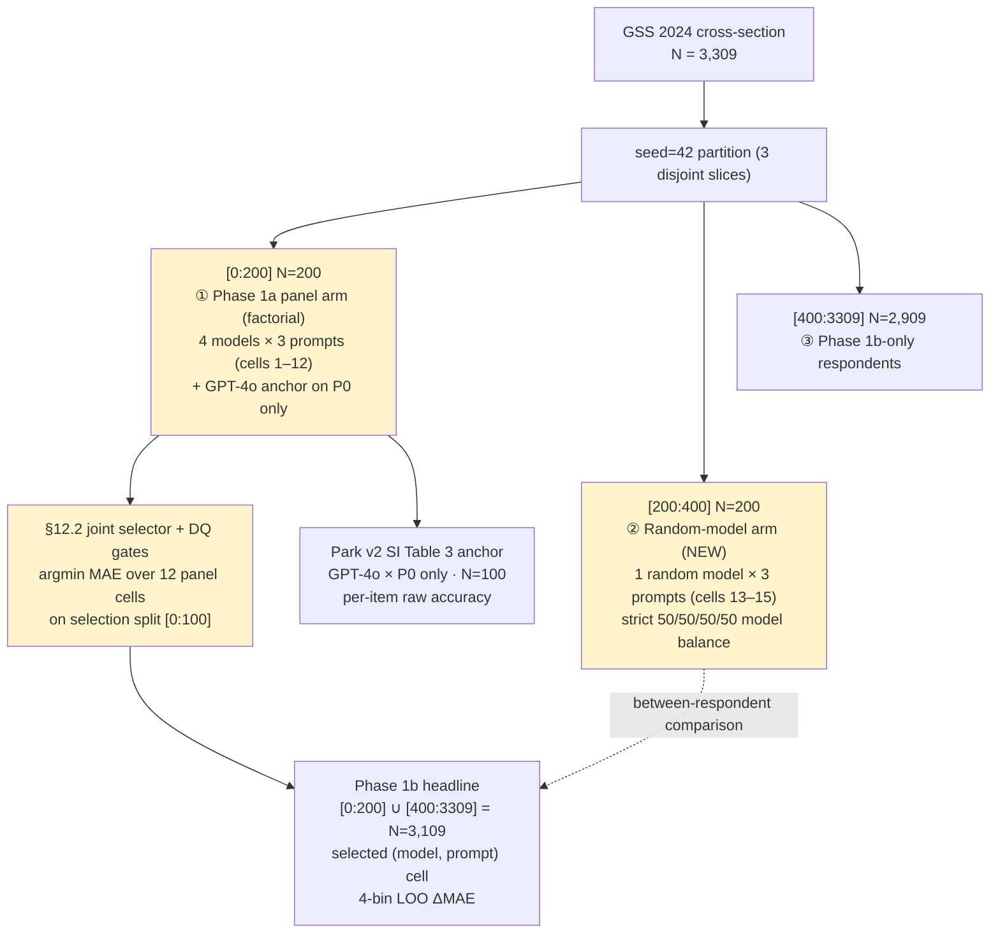

# Project Brief — Phase 1A Design Updates

**Author**: Joyce Yu
**Advisor**: Prof. Mohsen Bayati
**Date**: 2026-05-15
**Repository**: `github.com/Joyceqx/gsbgen390-persona-pipeline` (branch `mohsen-redesign`; pre-change snapshot tagged `pre-mohsen-redesign-2026-05-13`)

This brief proposes how to implement the two Phase 1A additions you suggested on 5/13: comparing a few prompt variants, and adding a random-model condition alongside the four-model panel. Phase 1B headline methodology, the GPT-4o anchor, and the Phase 1c plan are unchanged.

---

## 0. Summary

Phase 1A becomes a **5 × 3 factorial sweep** (15 cells) — 4 cheap models plus 1 random-assignment condition crossed with 3 literature-grounded prompts. §12.2 picks the best (model, prompt) cell jointly. The GPT-4o anchor still runs **only the baseline prompt P0**, so Park v2 SI Table 3 comparability is preserved.

| | P0 baseline | P1 1st-person | P2 interview Q&A |
|---|---|---|---|
| **Qwen-2.5-72B** | cell 1 | 2 | 3 |
| **DeepSeek-V3.1** | 4 | 5 | 6 |
| **Llama-3.3-70B** | 7 | 8 | 9 |
| **Kimi K2** | 10 | 11 | 12 |
| **Random-of-4 (between-respondent)** | 13 | 14 | 15 |

Cells 1–12 are the panel arm (within-respondent, N=200, all four models seen by each respondent). Cells 13–15 are the random-model arm (between-respondent, separate N=200, one randomly assigned model per respondent). The random arm is a sensitivity comparator for the panel-arm selection.

**Phase 1B headline N**: 3,309 → **3,109** (random-arm cohort held out; panel-arm cohort stays in headline with the same 100/100 post-selection-inference defense as OSF v1).

**Incremental Phase 1A cost**: +$47 (panel +$34 from the new prompts dimension, random arm +$13). **Total Phase 1**: ~$770 (+$14 vs. $756 OSF v1 envelope).

§3 walks through a real GSS 2024 respondent end-to-end so the abstract design is concrete. §4 explains DQ-1 and DQ-3 (the disqualification gates) since you asked us to look at them more carefully — no changes proposed.

---

## 1. Flow diagram

Yellow blocks are new or substantially changed this round. Slices are arranged left-to-right in experimental run order.



---

## 2. What each block does

### 2.1 Partition (3 slices)

| Slice | N | Phase 1A role | In Phase 1B headline? |
|---|---|---|---|
| `[0:200]` | 200 | panel arm — 4 models × 3 prompts | yes (under selected cell) |
| `[200:400]` | 200 | random arm — 1 random model × 3 prompts | **no — held out** |
| `[400:3309]` | 2,909 | — | yes (under selected cell) |

Phase 1B headline sample = `[0:200] ∪ [400:3309]` = **N=3,109**.

The random arm must be held out because its data validates §12.2's selection — re-using those respondents in the headline would create dependence between validation and headline. The panel cohort stays in the headline because the 100/100 selection/validation split inside `[0:200]` already protects against post-selection inference: §12.2 reads only `[0:100]`, and the selected cell's MAE on the held-out `[100:200]` is reported alongside the headline.

### 2.2 Phase 1a panel arm (factorial)

Every panel respondent runs all 12 (model × prompt) cells × 5 conditions (Full + 4 single-bin LOO) × 12 primary_eval items (subject to GSS ballot rotation). The comparison across cells is within-respondent. Cost: ~$51.

### 2.3 GPT-4o anchor — P0 only

GPT-4o runs on the 100-respondent selection split, on the **P0 baseline prompt only**, at n_samples=2, primary + 118 sensitivity items. This produces the Park v2 SI Table 3 anchor with per-item raw accuracy. P0 mirrors Park's surveys-only condition; if we ran the anchor on a different prompt, Park's table would stop being a directly comparable reference. Cost: ~$148 (unchanged from OSF v1).

### 2.4 Random-model arm

N=200 separate respondents, each assigned **one** of the four cheap models (50/50/50/50 via seed=42 hash). Each respondent runs all 3 prompts under their assigned model × 5 conditions × 12 items. This gives three between-respondent cells (13, 14, 15). Cost: ~$13.

Two things this arm produces, both reported alongside the panel-arm headline:

1. **Per-(model, prompt) MAE** in the between-respondent design — a sensitivity comparator for §12.2's selection.
2. **Bin-level LOO ΔMAE ranking** in the between-respondent design — a sensitivity comparator for the 4-bin LOO headline.

**Disagreement rule (pre-committed)**:

| Outcome | Interpretation |
|---|---|
| Both arms select the same cell, and bin-level rankings agree | Confirmatory; report random arm as a robustness column. |
| Selections differ, but random-arm winner is within 5% MAE of panel-arm winner on the random arm | "Within noise"; panel-arm headline stands. |
| Selections differ, random-arm winner is >5% better on the random arm | Documented as a design-dependence flag in the limitations section; panel-arm headline still holds per the locked §12.2 rule. |

**DQ on the random arm**: DQ-1 and DQ-3 are computed and reported for transparency, but **panel-arm DQ verdicts are the authoritative gates** for §12.2. The random arm has only ~50 respondents per (model, prompt) cell, which is too noisy for the variance-ratio test to be a gating decision.

### 2.5 §12.2 joint selector

OSF v1's §12.2 is generalized from "best model" to "best (model, prompt) cell". The selection logic is otherwise unchanged:

1. Compute parse-failure rate, per-item variance ratios, and respondent-macro Likert MAE for each of the 12 panel cells on the selection split `[0:100]`.
2. Apply DQ-1 and DQ-3 per cell (see §4).
3. If no cells survive → PAUSE; Phase 1B does not run.
4. argmin MAE among survivors. Tiebreak within 5% MAE on cost score; if both quality and cost tie within 1%, the named fallback Qwen × P0 fires.
5. Selected cell's MAE on held-out `[100:200]` is reported alongside the Phase 1B headline.

### 2.6 Phase 1b headline

Single (selected model, selected prompt) on N=3,109 respondents. Otherwise identical to OSF v1: primary_eval only, n_samples=1, Full + 4-bin LOO, paired-respondent bootstrap, Holm-Bonferroni at α=0.05 across the 4 bins. Cost: ~$67.

---

## 3. Concrete example: one GSS 2024 respondent end-to-end

To make the design concrete, here is what the pipeline does for the first respondent in the seed=42 sample — a publicly-released GSS 2024 respondent (all identifying info already removed by NORC).

### 3.1 The 12 prediction targets

| Variable | Construct | Format | Scale |
|---|---|---|---|
| POLVIEWS | political ideology | Likert-7 | 1 = Extremely liberal … 7 = Extremely conservative |
| PARTYID | party identification | Likert-7 + Other | 0 = Strong Democrat … 6 = Strong Republican (7 = Other) |
| ABANY | abortion attitudes | binary | 1 = YES, 2 = NO |
| CAPPUN | death penalty | binary | 1 = FAVOR, 2 = OPPOSE |
| GUNLAW | gun control | binary | 1 = FAVOR (permits), 2 = OPPOSE |
| FECHLD | gender role attitudes | Likert-4 | 1 = Strongly agree … 4 = Strongly disagree |
| FEPOL | women in politics | binary | 1 = AGREE, 2 = DISAGREE |
| RACDIF1 | racial attitudes | binary | 1 = YES (discrimination), 2 = NO |
| CONFINAN | confidence in banks | Likert-3 | 1 = A great deal … 3 = Hardly any |
| CONLEGIS | trust in Congress | Likert-3 | 1 = A great deal … 3 = Hardly any |
| HELPPOOR | govt help for poor | Likert-5 sparse-anchor | 1 = Govt should improve … 5 = Each person should |
| SATFIN | financial satisfaction | Likert-3 | 1 = Pretty well satisfied … 3 = Not at all |

GSS uses ballot rotation, so any one respondent typically sees ~8 of these 12 items. The headline metric excludes ballot-missing items per respondent.

### 3.2 Who she is

A 24-year-old white female, never married, Bachelor's degree, German ancestry. Currently in the Northeast (grew up Midwest). Full-time, 55 hr/week. Catholic but self-describes "not religious at all"; attends services less than once a year. Very happy, very satisfied with work, finds life exciting. Voted Biden in 2020.

GSS 2024 records 140 variables for her across our four bins. Substantively:

- **Demographic** (20 vars): age 24, female, white, never-married, Bachelor's, family income $75–89K, both parents have graduate degrees, family income at 16 "far above average", etc.
- **Behavioral** (18 vars): full-time at 55 hrs/wk, watches TV 2 hr/day, attends religious services less than once a year, never prays, Catholic, no gun at home, reads newspaper daily, voted Biden 2020, etc.
- **Psychological** (4 vars): very happy, exciting life, very satisfied with work, good health.
- **Attitudinal** (33 vars, excluding the 12 prediction targets): pro-choice on all 7 abortion conditions, strongly disagrees with traditional gender roles, supports gun control / immigration / sex education / birth control for teens, opposes spanking, supports physician-assisted suicide for incurable illness only, etc.

Her ground-truth answers on the 12 prediction targets:

| Variable | Answer | On her ballot? |
|---|---|---|
| POLVIEWS | Slightly liberal (3) | yes |
| PARTYID | Not very strong democrat (1) | yes |
| ABANY | YES (1) | yes |
| GUNLAW | FAVOR (1) | yes |
| FECHLD | AGREE (2) | yes |
| RACDIF1 | YES (1) | yes |
| SATFIN | Pretty well satisfied (1) | yes |
| CAPPUN, FEPOL, CONFINAN, CONLEGIS, HELPPOOR | (not on her ballot) | no |

The pipeline never sees these target values during prompt construction (R1 leakage hygiene removes the whole battery containing the predicted item).

### 3.3 The P0 baseline persona prompt

Plugging her 75 substantive responses into `build_persona_prompt()` produces the P0 baseline below. This is the exact system message the LLM sees under cells 1, 4, 7, 10 (Qwen / DeepSeek / Llama / Kimi × P0). For LOO conditions, the entire matching `## YOUR …` section is dropped (e.g., when predicting POLVIEWS under the attitudinal-LOO condition, the `## YOUR ATTITUDES` block is removed). The prompt is **75 features, ~1,012 tokens** for her.

```
You are a person who completed the 2024 General Social Survey (GSS). Below is
what you told the survey, organized by topic. Stay in character as this
respondent throughout — your views, your demographics, your behaviors are as
described.

You may be asked further survey questions. Answer ENTIRELY IN CHARACTER as this
person, drawing on the consistency of the views and life context shown below.
Always commit to a single answer in the requested format. No "it depends"
hedges, no refusals, no qualifications about being an AI.

## YOUR DEMOGRAPHIC BACKGROUND
- age of respondent: 24
- was r born in this country: YES
- r's highest degree: Bachelor's
- did rs family own or rent home when r was age 16: Owned or was buying
- highest year of school completed: 4 years of college
- country of family origin: Germany
- living with parents when 16 yrs old: Both own parents
- hispanic specified: Not Hispanic
- r's family income when 16 yrs old: FAR ABOVE AVERAGE
- total family income: $75,000 to $89,999
- Mother's highest degree: Graduate
- Highest year school completed, mother: 8 or more years of college
- marital status: Never married
- geographic mobility since age 16: Different state
- Father's highest degree: Graduate
- Highest year school completed, father: 8 or more years of college
- race of respondent: White
- region of residence, age 16: Midwest
- region of interview: Northeast
- respondents sex: FEMALE

## YOUR BEHAVIORS
- how often r attends religious services: Less than once a year
- r use computer: YES
- how fundamentalist is r currently: Moderate
- number of hours worked last week: 55
- does r or spouse or partner hunt: NEITHER HUNTS
- could r find equally good job: Somewhat easy
- is r likely to lose job: Not likely
- how often does r read newspaper: Every day
- have gun in home: NO
- was r's work part-time or full-time?: Full-time
- how often does r pray: Never
- VOTED TRUMP OR BIDEN: Biden
- r's religious preference: Catholic
- religion in which raised: Catholic
- hours per day watching tv: 2
- remember if voted in 2016 election: Ineligible
- REMEMBER IF VOTED IN 2020 ELECTION: Voted
- labor force status: Working full time

## YOUR PSYCHOLOGICAL DISPOSITIONS
- general happiness: Very happy
- condition of health: Good
- is life exciting or dull: Exciting
- work satisfaction: Very satisfied

## YOUR ATTITUDES
- strong chance of serious defect: YES
- woman's health seriously endangered: YES
- married--wants no more children: YES
- low income--cant afford more children: YES
- pregnant as result of rape: YES
- not married: YES
- allow anti-religionist to teach: ALLOWED
- allow racist to teach: ALLOWED
- whites hurt by aff. action: Not very likely
- better for man to work, woman tend home: STRONGLY DISAGREE
- should hire and promote women: NEITHER AGREE NOR DISAGREE
- preschool kids suffer if mother works: DISAGREE
- homosexual sex relations: NOT WRONG AT ALL
- number of immigrants nowadays should be: Increased a little
- assistance for childcare: TOO LITTLE
- developing alternative energy sources: Too little
- highways and bridges: TOO LITTLE
- supporting scientific research: TOO LITTLE
- social security: ABOUT RIGHT
- birth control to teenagers 14-16: STRONGLY AGREE
- differences due to in-born learning ability: NO
- differences due to lack of education: YES
- differences due to lack of will: NO
- has r ever had a 'born again' experience: NO
- r consider self a religious person: Not religious at all
- sex education in public schools: Favor
- favor spanking to discipline child: DISAGREE
- r consider self a spiritual person: Not spiritual at all
- suicide if incurable disease: YES
- suicide if bankrupt: NO
- suicide if tired of living: NO
- r's federal income tax: Too high
- sex with person other than spouse: ALWAYS WRONG

---

You will now be asked one or more additional GSS questions. Answer in character,
in the exact format requested by each question.
```

### 3.4 The item-question prompt

After the persona is set as the system message, each primary_eval item becomes its own user message. Examples:

**POLVIEWS (Likert-7)** — her truth is 3 (Slightly liberal). If the LLM outputs `3`, error = 0; if it outputs `5`, error = 2.

```
GSS question: think of self as liberal or conservative

Options:
  1. Extremely liberal
  2. Liberal
  3. Slightly liberal
  4. Moderate, middle of the road
  5. Slightly conservative
  6. Conservative
  7. Extremely conservative

Output ONLY a single integer code (1-7).
```

**GUNLAW (binary)** — her truth is 1 (FAVOR). Binary items use exact-match accuracy in the headline; §12.2 scoring uses Likert MAE only.

```
GSS question: favor or oppose gun permits

Options:
  1. FAVOR
  2. OPPOSE

Output ONLY a single integer code (1-2).
```

**FEPOL (binary, stem-overridden for clarity)** — she is not on the FEPOL ballot, so the pipeline skips this item for her.

```
GSS question: Tell me if you agree or disagree with this statement: "Most men
are better suited emotionally for politics than are most women."

Options:
  1. AGREE
  2. DISAGREE

Output ONLY a single integer code (1-2).
```

### 3.5 What this respondent costs to run

Under the factorial design, this respondent (in the panel arm) generates approximately **420 LLM calls**: 7 ballot-on items × 5 conditions × 4 models × 3 prompts. Add ~356 calls for the GPT-4o anchor (since she is in the selection split, primary + sensitivity, n=2, P0 only). At ~$0.0004/call, the cheap-panel cost for her is about $0.17; the full N=200 panel runs to ~$51.

A random-arm respondent (in `[200:400]`) generates 7 × 5 × 1 × 3 ≈ 105 calls — one assigned model, all three prompts. Full random arm: ~$13.

---

## 4. Disqualification framework — DQ-1 and DQ-3

§12.2 doesn't just argmin MAE. Each of the 12 panel cells must first pass two pre-registered gates: DQ-1 (parse-failure ceiling) and DQ-3 (mode-collapse guard). A cell that fails either is removed from the candidate pool, regardless of its MAE.

The framework is unchanged from OSF v1; the only structural change is that DQ now applies per (model, prompt) cell rather than per model. We include this walk-through because you asked us to examine disqualification more carefully on 5/13.

### 4.1 DQ-1 — Parse-failure ceiling

```
DQ-1 metric    = (# parse-fail samples) / (# total samples)  per cell
Cell passes if parse-failure rate ≤ 30%
```

A parse failure is any output that can't be parsed to a valid integer code: refusals ("As an AI…"), hedges ("It depends…"), verbose justifications, out-of-range codes, API errors.

**Why 30%**: A cell with worse than 30% parse failures is operationally unusable at the scale Phase 1B requires. The MAE on its parsed remainder would be unreliable anyway (selection bias). 30% is loose enough to absorb minor formatting glitches but tight enough to catch systemic refusal.

### 4.2 DQ-3 — Mode-collapse guard

```
For each primary_eval item i in a cell:
    ratio_i = var(cell_predictions_i) / var(human_GSS_2024_responses_i)
    item_i fails the floor if ratio_i < 0.30

Cell passes DQ-3 if at most 50% of items fail the floor.
```

The guard catches cells whose predictions are too concentrated relative to the human distribution — for example, a model that always answers "4 (Moderate)" on POLVIEWS for every respondent.

**Concrete example.** A hypothetical "always answer mode" cell — outputs the modal code on every item, regardless of persona:

| Item | Human variance | Cell variance | Ratio | Fails? |
|---|---|---|---|---|
| POLVIEWS | 2.34 | 0.00 | 0.00 | yes |
| PARTYID | 4.24 | 0.00 | 0.00 | yes |
| ABANY | 0.25 | 0.00 | 0.00 | yes |
| GUNLAW | 0.21 | 0.00 | 0.00 | yes |
| FECHLD | 0.93 | 0.00 | 0.00 | yes |
| FEPOL | 0.15 | 0.00 | 0.00 | yes |
| RACDIF1 | 0.25 | 0.00 | 0.00 | yes |
| CONFINAN | 0.49 | 0.00 | 0.00 | yes |
| CONLEGIS | 0.45 | 0.00 | 0.00 | yes |
| HELPPOOR | 1.78 | 0.00 | 0.00 | yes |
| CAPPUN | 0.21 | 0.00 | 0.00 | yes |
| SATFIN | 0.51 | 0.00 | 0.00 | yes |

All 12 items fail → fail_pct = 100% > 50% → cell **disqualified**.

For comparison, a "healthy" cell with reasonable spread:

| Item | Human variance | Cell variance | Ratio | Fails? |
|---|---|---|---|---|
| POLVIEWS | 2.34 | 1.80 | 0.77 | no |
| PARTYID | 4.24 | 3.10 | 0.73 | no |
| ABANY | 0.25 | 0.22 | 0.88 | no |
| GUNLAW | 0.21 | 0.18 | 0.86 | no |
| FECHLD | 0.93 | 0.80 | 0.86 | no |
| (…) | | | (>0.30) | no |

Cell **passes** DQ-3.

**Why per-item relative**: Human variance varies across items — FEPOL ≈ 0.15 (heavily skewed binary), PARTYID ≈ 4.24 (wide Likert-7 spread). An absolute threshold would be too lenient on FEPOL and too strict on PARTYID. Scaling to each item's human spread gives a comparable strictness across items.

**Why "majority of items must fail", not "any single item"**: GSS ballot rotation means each cell only sees a fraction of respondents on each item, so per-item variance estimates are noisy. The 50% majority rule is robust to that noise.

**Why this gate matters**: A mode-collapsed cell can have surprisingly low MAE because most GSS attitudes cluster centrally and "always 4" gets close to many respondents. Without DQ-3, §12.2 could pick a cell whose low MAE comes from giving up on individuation rather than from learning the persona. DQ-3 rejects such cells regardless of MAE.

### 4.3 All-DQ-fail handling: PAUSE

If every panel cell fails one of the gates, §12.2 returns `selected = None` and Phase 1B does **not** proceed. The rationale: an empty pool means something structural is broken — prompt template, parser, model panel snapshot, or the human-variance reference. Silently falling back to a named model would burn paid Phase 1B spend on a known-failing setup. The PAUSE forces human review and either a rerun of Phase 1A or an OSF amendment.

---

## 5. Decisions in detail

### 5.1 Why factorial rather than sequential sweep-then-panel

Two reasons.

First, a factorial design captures **(model × prompt) interactions**. If P2 helps Llama but hurts Kimi, a sequential design that picks "best prompt averaged across models" misses this and may pick a prompt that's mediocre everywhere. The factorial lets §12.2 read the joint winner directly.

Second, **no separate sweep cohort is needed**. The panel arm is the sweep — every prompt is tested on the same 200 respondents across all four models. Phase 1B's headline N is reduced only by the random-arm carve-out (200 respondents), not by a separate sweep carve-out.

The cost is +$34 on the panel arm (three prompts instead of one). The user explicitly chose to absorb this cost in exchange for clean joint selection.

### 5.2 Prompt candidates — the 2 × 2 ablation

The three prompts vary along two design knobs: **voice** (1st-person vs. 2nd-person) and **structure** (key-value list vs. interview Q&A turns).

| Candidate | Voice | Structure | Citation |
|---|---|---|---|
| **P0 baseline** | 2nd person | 4-bin key-value list | Park et al. 2024 v2 (arXiv:2411.10109), surveys-only condition |
| **P1 Argyle 1st-person prose** | 1st person | 4-bin clauses | Argyle et al. 2023 "Out of One, Many", *Political Analysis* 31(3) |
| **P2 Wang interview Q&A** | 2nd person (dialogue) | 4-bin Q-A turns | Wang et al. 2025 "The Prompt Makes the Person(a)", *Findings of EMNLP 2025* |

**Why these three**:

- **P0**: the citation baseline (mirrors Park v2's surveys-only condition).
- **P2**: the only prompt-format ablation in the persona-simulation literature with a head-to-head winner (Wang's 5 LLMs × 15 demographic groups × 100 OpinionQA items found interview Q&A best on stereotyping and opinion alignment).
- **P1**: fills a literature gap — Argyle uses 1st-person prose; Park/Hu/Bisbee/our baseline use 2nd person; no paper has compared them head-to-head on a survey-prediction task. Including P1 makes the sweep a 2 × 2 (voice × structure) that decomposes where any improvement comes from.

**Why not other variants** considered and excluded:

- Plain CoT: Sun et al. 2025 (PB&J) show CoT gives **no gain** on OpinionQA (49.17% vs 49.63% baseline).
- Variable reordering within bins: Hu & Collier 2024 show "little variation" from reorder/reparagraph.
- PB&J scaffolded rationale: +4.8 pp in Sun 2025, but needs an extra LLM pre-pass. Better evaluated as Phase 2.
- Salecha brand-name removal: small expected effect; would cost a slot.

**The three prompts on the §3 respondent**:

P0 appears in §3.3 above. P1 (Argyle):

```
I am a respondent of the 2024 General Social Survey. Below is who I am, organized
by topic. I will answer further survey questions in character, in the exact format
requested. I will commit to a single answer per question and will not hedge,
refuse, or break character.

## ABOUT ME — DEMOGRAPHICS
I am 24 years old. I am female. I am white. I have never been married. I have a
Bachelor's degree. My total family income is between $75,000 and $89,999. …

## ABOUT ME — BEHAVIORS
I attend religious services less than once a year. I voted for Biden in 2020. I
work full-time, 55 hours per week. …

## ABOUT ME — PSYCHOLOGICAL DISPOSITIONS
I am very happy in general. I find life exciting. I am very satisfied with my
work. My health is good.

## ABOUT ME — ATTITUDES
[1st-person clauses for the 33 substantive attitudinal responses ...]
```

P2 (Wang interview Q&A):

```
The following is an interview transcript with a respondent of the 2024 General
Social Survey. The respondent answered questions about themselves, their
behaviors, their psychological dispositions, and their attitudes.

You will later be asked to continue answering in the voice of this same
respondent, in the exact format requested. You will commit to a single answer
per question and will not hedge, refuse, or break character.

## DEMOGRAPHIC BACKGROUND
Interviewer: How old are you?
Respondent: I am 24.
Interviewer: What is your sex?
Respondent: Female.
Interviewer: What is your race?
Respondent: White.
Interviewer: What is your marital status?
Respondent: I have never been married.
…

## BEHAVIORS
Interviewer: How often do you attend religious services?
Respondent: Less than once a year.
…
```

All three preserve the 4-bin structure (LOO works on each), preserve per-item exclusion for AUDIT-D, and produce the same single-integer output format at item time.

### 5.3 §12.2's joint selection rule

For each of the 12 panel cells, compute the respondent-macro Likert MAE on `[0:100]`. argmin MAE among DQ-passers wins. If two cells are within 5% of best MAE, tiebreak on cost; if both quality and cost tie within 1%, default to Qwen × P0 (the named fallback from OSF v1). The selected cell's MAE on `[100:200]` is reported alongside the Phase 1B headline.

MAE is used (not Park's normalized accuracy) because GSS 2024 has no test-retest baseline to normalize against; OSF v1 §10 already locks raw MAE as the headline metric.

### 5.4 Random-arm sample size and allocation

**Decision**: N=200 in `[200:400]`, strict 50/50/50/50 model assignment by seed=42 hash, all 3 prompts tested under each respondent's assigned model.

| Alternative | Cost | Per-(model, prompt) N | Verdict |
|---|---|---|---|
| Post-hoc subsample of panel | $0 | ~50 (not a real between-respondent design) | rejected |
| **N=200 in [200:400]** | ~$13 | 50 | **selected** |
| N=100 in [200:300] | ~$7 | 25 | rejected — too noisy |
| N=400 | ~$27 | 100 | rejected — doubles the Phase 1B carve-out |

Strict balance (rather than true random assignment) is chosen because the goal is tight per-cell CIs for the cross-arm comparison, not a randomized causal trial.

---

## 6. Budget

| Item | OSF v1 | Proposed | Δ |
|---|---|---|---|
| Smoke (N=10 plumbing check) | $1 | $1 | 0 |
| **Phase 1a panel (NEW: 3 prompts)** | $17 | $51 | +34 |
| **Random-model arm (NEW)** | — | $13 | +13 |
| GPT-4o anchor (P0 only) | $148 | $148 | 0 |
| Phase 1b cheap (N=3,309 → 3,109) | $71 | $67 | −4 |
| **Subtotal (pre-Battery LOO)** | **$237** | **$280** | **+43** |
| Battery LOO (scales with N) | $481 | $452 | −29 |
| Shapley 16-condition | $38 | $38 | 0 |
| **Total Phase 1** | **$756** | **$770** | **+14** |

---

## 7. Questions for your review

1. **Joint (model, prompt) selection (§2.5, §5.3)**: comfortable with §12.2 generalized from "best model" to "best cell"? The rule structure is unchanged from OSF v1; only the domain expands from 4 to 12 cells.
2. **Prompt candidates (§5.2)**: are P0 + P1 + P2 the right three? Specifically, want a 4th candidate (Salecha brand-name removal or PB&J scaffold)?
3. **Random-arm size (§5.4)**: is N=200 right, or do you want N=400 for tighter per-cell CIs (at the cost of Phase 1B dropping to N=2,909)?
4. **End-to-end example (§3)**: right pitch of concreteness, or would you like a fully worked single-call example (system message + user message + actual model output + score)?
5. **Disqualification framework (§4)**: does the per-cell variance-ratio DQ-3 rule address what you had in mind, or were you pointing at a different dimension (thresholds, all-DQ-fail handling, metric design)?
6. Anything else from the 5/13 meeting I have under-weighted.

---

## 8. Supporting materials

- This brief: `Project Brief — Phase 1A Updates 2026-05-15.md`
- Working branch: `github.com/Joyceqx/gsbgen390-persona-pipeline/tree/mohsen-redesign`
- Snapshot tag (rollback point): `pre-mohsen-redesign-2026-05-13`
- Supporting literature review (Park v2, Argyle 2023, Wang 2025, Sun 2025, Hu & Collier 2024, Bisbee 2024, Salecha 2024, Aher 2023, Horton 2023): `lit_review_prompt_variants_2026-05-15.md` on the branch
- Original 5/10 OSF brief (cross-reference): `Project Brief for Professor Bayati.md`
- OSF v1 draft: `osf_preregistration_v1.md`

---

*Joyce Yu, GSBGEN390 thesis-track research, Stanford GSB Spring 2026.*
