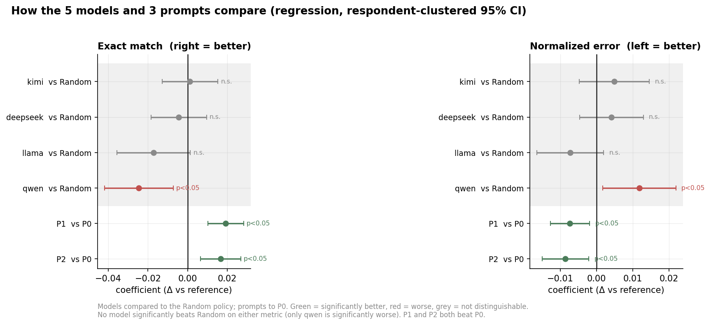
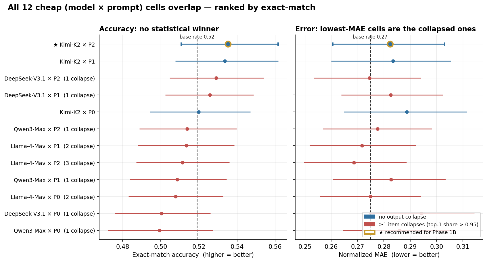
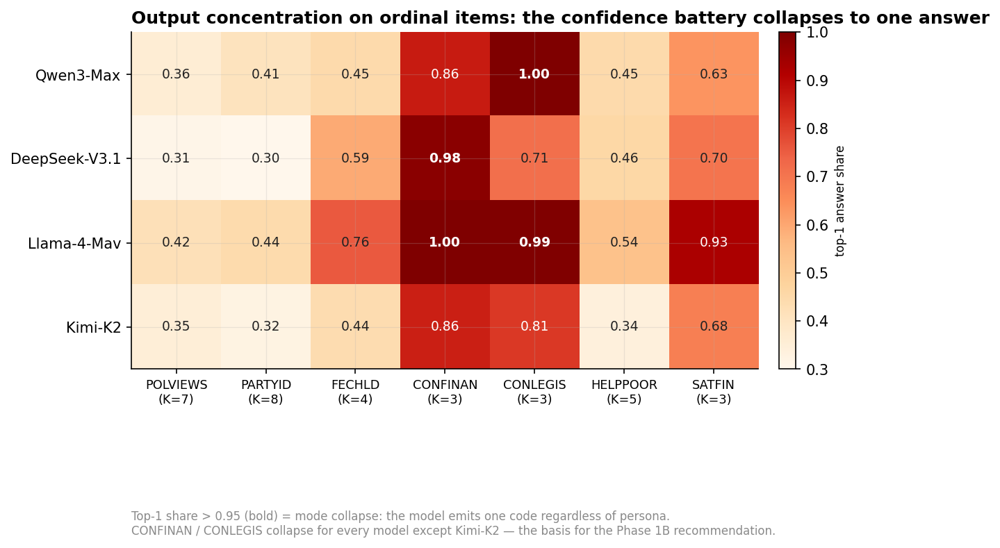
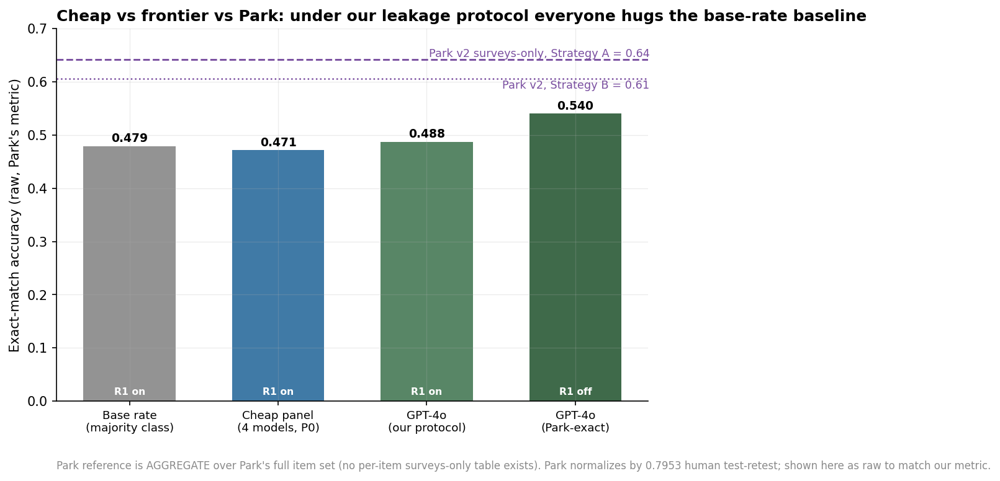
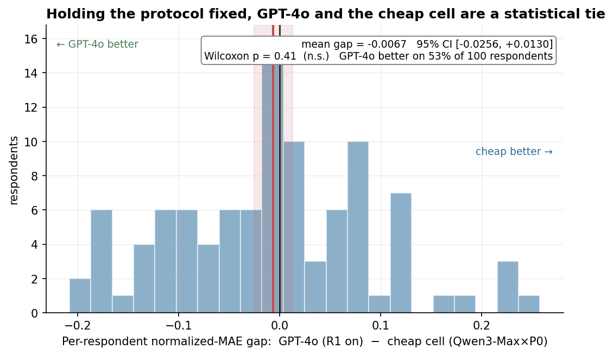
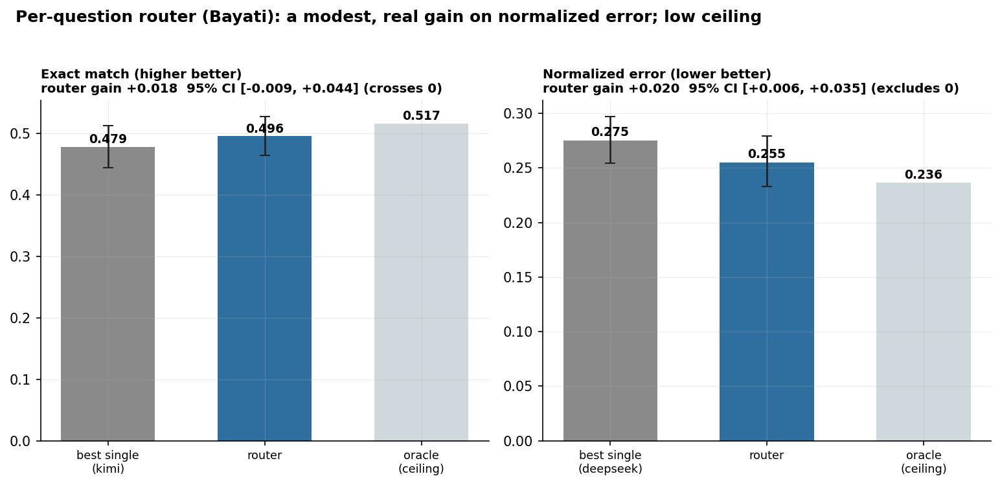

# Phase 1A Results: Choosing a Cheap LLM to Simulate GSS 2024 Attitudes

**Joyce Yu · Stanford GSB · GSBGEN390 · Advisor: Prof. Mohsen Bayati**
**Run date: 2026-06-01 · Report date: 2026-06-02**
*Numbers are computed from the raw prediction file (`phase1a_raw_predictions.csv`,
48,150 rows) and reconciled with the databook `raw_tables.xlsx`. The scoring and
the regression follow Prof. Bayati's `phase1a_metrics_and_router.ipynb`.*

The goal of Phase 1A is to pick **one (model, prompt) combination** to run at full
scale in Phase 1B, where its job is **feature attribution** — measuring how much
each category of survey features contributes to the prediction. We tested four
cheap LLMs and three prompt formats as GSS respondent personas, and ran GPT-4o as
an expensive reference.

---

## 1. The short version

1. **Normalized error is the right scoreboard, not exact match.** Being one step
   off on a 7-point scale is not the same as missing a yes/no, and exact match
   hides that. We score on normalized error and report exact match alongside.
2. **On normalized error, no model beats a random mix of the four.** Once the
   standard errors account for repeated respondents, only one model (Qwen) is
   distinguishable at all, and it is *worse*. By the metrics, the Random policy is
   a perfectly good choice and the models barely differ.
3. **The one place the models really differ is mode collapse — and only Kimi
   avoids it.** On some questions every other model gives the *same* answer to all
   200 respondents. The metrics reward this (collapsing to the middle keeps the
   error small), but the model is ignoring the persona, which matters for Phase 1B
   attribution.
4. **Prompt is the one clear lever.** P1 and P2 both beat P0, significantly, on
   both metrics; they are tied with each other.
5. **We are not concluding the model choice here.** The metrics say any model
   (including Random) is fine; the collapse concern says only Kimi keeps every
   question usable. How to weigh those two is a judgment we are leaving to the
   advisor (§5). This report does the analysis and lays out the trade-off.
6. **GPT-4o is no better than the cheap model under the same rules** (a coin flip,
   p = 0.41). Cheap is good enough — the central result that licenses the approach.
7. **A per-question router helps a little but routes to the collapsed models;** we
   keep it as a secondary result.

---

## 2. How we score, and what we choose on

### 2.1 Why normalized error is the primary metric

Exact match treats every miss the same. For a binary item that is fine, but for
an ordinal item it is misleading: on the 7-point POLVIEWS scale, predicting
"liberal" when the truth is "slightly liberal" is nearly right, yet exact match
scores it a full miss. So we use **normalized error**: the absolute distance
divided by the item's range, which puts every item on a 0-to-1 scale where one
step on a 7-point item is a small error and missing a yes/no is a full one. A
parse failure is penalized as the maximum error of 1, so a model cannot dodge a
hard question by returning garbage.

The metric matters because the per-item picture *inverts* between the two scores.
POLVIEWS and PARTYID have the **worst** exact match (~0.31) but the **best**
normalized error (~0.19), because the models usually land close even when they
miss. The binary items are the reverse. Exact match alone would tell you the
7-point items are hopeless; normalized error shows they are the easiest. For
ordinal survey data, normalized error is the honest scoreboard. We keep exact
match as a secondary number because it is what Park et al. report, so it lets us
compare externally (§6).

### 2.2 The selection criteria, in order

Phase 1B uses these predictions for feature attribution, not for prediction
accuracy. That sets the criteria:

1. **Normalized error (the metric).** Lower is better, compared with confidence
   intervals. If the candidates' intervals overlap, the metric cannot pick a
   winner. *This is the situation we are in.*
2. **Mode collapse (the thing the metric misses).** A model can post a good error
   while giving one code to everyone, because collapsing to the middle code keeps
   the average distance small. That matters for Phase 1B: if a model always
   answers "2" on a question, dropping a feature cannot change the answer, so the
   attribution for that question is mechanically zero. So a low error does not by
   itself mean a model is usable.
3. **Prompt effect.** Prefer the prompt format that is reliably better.
4. **Cost.** Cheaper is better, all else equal.

These are the lenses the analysis is built on. They pull in different directions
here — the metric says any model is fine, the collapse check says only one is —
which is exactly the trade-off we lay out in §5 and leave for the advisor.

---

## 3. Setup (brief)

Four cheap models — **Qwen3-Max, DeepSeek-V3.1, Llama-4-Maverick, Kimi-K2** —
plus a fifth policy, **Random**, that answers each respondent with one of the four
chosen at random (the deployment baseline). Three prompts: **P0** key-value list
(Park 2024), **P1** first-person (Argyle 2023), **P2** interview Q&A (Wang 2025).
12 GSS attitude questions, 200 respondents, two draws per call. GPT-4o is the
expensive reference (§6). Parse failures are 0.31% of all calls.

---

## 4. The comparison, point by point

### Point 1 — On normalized error, no model beats Random

The figure is a regression of each metric on model, prompt, and item, with
standard errors clustered by respondent (the honest version: each respondent
appears many times and each call has two near-identical draws, which the naive
errors ignore). Models are compared to the Random policy, prompts to P0.

Read the model rows. On both metrics, **Kimi, DeepSeek, and Llama are all
statistically tied with Random** (grey, intervals cross zero). The only model
that separates is **Qwen, and it is significantly worse.** No model is
significantly *better* than a random mixture of the four. In plain terms: the
choice of model does not move the score.

| | exact match | vs Random | normalized error | vs Random |
|---|---:|---|---:|---|
| kimi | 0.494 | tied (p=0.87) | 0.273 | tied (p=0.32) |
| deepseek | 0.488 | tied (p=0.53) | 0.272 | tied (p=0.35) |
| llama | 0.475 | tied (p=0.07) | 0.261 | tied (p=0.12) |
| qwen | 0.468 | **worse** (p=0.005) | 0.280 | **worse** (p=0.02) |
| Random | 0.493 | — | 0.268 | — |

### Point 2 — The two metrics disagree, because some models hedge or collapse

On exact match, Kimi is at the top and Llama near the bottom. On normalized error
the order reverses and Llama comes out lowest. The reason is the kind of mistakes
each makes. Kimi is confident: it gets more exact hits, but when it is wrong it is
sometimes badly wrong (on POLVIEWS it is roughly twice as likely to be off by
three or more steps). Llama is the opposite: it rarely commits, piling its answers
near the middle, so it gets fewer exact hits but its errors are small. Exact match
rewards Kimi's confident hits; normalized error rewards Llama's caution. The right
panel above shows it directly — **the lowest-error cells are the collapsed ones.**

But "small errors" splits into two very different behaviors, and only one is
healthy:

| Where Llama beats Kimi on error | Llama's top-1 answer share | What it is |
|---|---:|---|
| POLVIEWS, PARTYID, HELPPOOR | 0.42–0.54 | genuine hedging (uses the scale) |
| FECHLD, SATFIN, FEPOL | 0.76–0.93 | heavy concentration |
| CONFINAN | **1.00** | full collapse — one answer for everyone |

On the wide scales Llama genuinely hedges, which is fine. On the narrow items its
low error comes from collapsing onto the single most common answer — it is riding
the base rate, not reading the persona. Normalized error cannot tell these apart.

### Point 3 — Mode collapse breaks the tie, and only Kimi avoids it

Each cell is the share of respondents who got a model's single most common answer.
Above 0.95 (bold) means the model gave essentially one answer to everyone. The two
institutional-trust questions (CONFINAN, CONLEGIS) trigger this in **every model
except Kimi** — Llama and Qwen hit 1.00, DeepSeek 0.98. Kimi stays below 0.95 on
every question and every prompt.

This is the concern the metric cannot see. Because Phase 1B attributes feature
importance by removing a feature and watching the prediction move, a collapsed
question gives no movement and therefore no attribution. The model with the lowest
error (Llama) is collapsed on exactly the questions where we most need it to
respond; the model that never collapses (Kimi) keeps those questions usable. We
are flagging this, not resolving it (§5).

### Point 4 — Prompt is the real lever

Back to the regression (Point 1, fig 10): the prompt rows are the only effects
that are both significant and in the right direction. **P1 and P2 both beat P0**
on exact match and on normalized error (all p < 0.01).

| Prompt | normalized error | exact match | vs P0 |
|---|---:|---:|---|
| P0 (key-value) | 0.276 | 0.472 | reference |
| P1 (first-person) | 0.269 | **0.491** | both p < 0.01 |
| P2 (interview) | **0.268** | 0.488 | both p < 0.01 |

P1 and P2 are about even with each other: P2 is better on normalized error by
0.001, P1 is better on exact match by 0.003, both within noise. The robust result
is that *both beat P0*. If we go by the primary metric we would lean P2, but P1 is
equally defensible.

---

## 5. What the analysis points to — an open question for the advisor

We are not closing the model choice here. The analysis points two ways, and which
one wins is a judgment call we would rather make with Prof. Bayati than settle
unilaterally.

- **If we go by the metric:** all four models tie with Random — the choice does
  not move the score, so the simplest defensible answer is "any of them, or the
  Random policy." This is the read his notebook supports.
- **If we weight the collapse concern:** only **Kimi** keeps every question
  responding to the persona. The lower error of Llama and DeepSeek is partly a
  collapse artifact, and a collapsed question is dead for Phase 1B attribution. On
  this read, Kimi is the safe choice.

The prompt is the one part that is not in tension: **P1 and P2 both beat P0**, so
we would fix the prompt to **P2** (marginally best on normalized error; P1 equally
good) regardless of the model.

So the open question is narrow and concrete: **how much weight to put on mode
collapse, which the error metric does not penalize.** Lean on the metric and
Random/any model is fine; lean on attribution and it is Kimi. We have laid out
both; the call is yours.

A note on **Random**, because it is easy to over-read: "Random" here is a random
mixture of the four real models, *not* random guessing. The models clearly beat
chance (POLVIEWS 0.30 vs 0.14 for a uniform guess); they just do not beat *each
other*. So the honest headline is "model choice does not move the score," not "the
models are no better than chance."

---

## 6. Cheap vs. the expensive model (GPT-4o): the cheap model is good enough

GPT-4o ran on the same 100 respondents under our leakage rule. The base rate, the
cheap panel, and GPT-4o land within two points of each other on exact match
(0.479 / 0.471 / 0.488).

Head to head on the same respondents, GPT-4o beats the cheap cell by 0.007
normalized error, with a confidence interval that crosses zero (p = 0.41) and a
win on 53% of people — a coin flip. **Paying about seven times more per call buys
no measurable accuracy here.** GPT-4o only pulls ahead (to 0.540 exact match) when
we relax our leakage rule to Park's, which is a difference in the *rule*, not the
model. This is the result that licenses the whole approach: a cheap model is good
enough to scale Phase 1B.

For context against the literature, our Park-matched GPT-4o reaches 0.540 vs
Park's reported 0.64 aggregate; the gap is our deliberately harder question set
and our survey-only personas (Park also used interviews), which is the
survey-vs-interview tradeoff the project is built to measure. And against a *fair*
floor — the same model run with no persona at all — the persona does add real
signal (+0.04 normalized accuracy, beating its own no-persona prior on 9 of 12
questions), even though it only ties the harder base-rate guess.

---

## 7. A per-question router (secondary)

Prof. Bayati's idea: instead of one model for everything, learn a small table —
one model per question — on 100 respondents and test on a clean held-out 100. It
works, modestly. On normalized error the router beats the best single model by
0.020, with a confidence interval that excludes zero. On exact match the gain is
similar but the interval crosses zero, so it is suggestive only. The ceiling is
low: even perfect per-question routing reaches just ~0.52 exact match, and the
router already captures most of that.

We treat this as a secondary, prediction-focused result rather than the basis for
the Phase 1B choice, for two reasons. First, its learned policy routes the
collapse-prone questions to the collapsing models (CONFINAN → Llama at top-1 1.00,
SATFIN → Llama at 0.93) — it minimizes error by selecting exactly the behavior
that kills attribution. Second, routing a different model per question entangles
"which feature matters" with "which model answered," which complicates the
attribution story for a modest gain. It is a good robustness extension (and a nice
result in its own right); it is not the main design.

---

## 8. Open decisions for you

1. **Prediction vs. attribution is the real fork** (the main open call). If Phase
   1B optimizes prediction, the metric says Random / any model is fine (and the
   router adds a little). If it optimizes attribution — the stated goal — the
   collapse concern argues for Kimi, the only persona-responsive model. We have
   laid out both sides (§5); the weighting is yours.
2. **Deploy cell vs. the locked selector.** The automatic §7 selector returns
   Qwen × P0 (it ranks on error, which rewards collapse, then defaults). Whichever
   model we land on, that default should be revisited.
3. **Park stays at the aggregate level.** Park published no per-question
   survey-only table, so we compare only to their aggregate (§6).
4. **No-persona baseline at scale.** Worth running the same no-persona arm on the
   chosen cell in Phase 1B so attribution has a fair zero point.

---

## Appendix: methods

- **Scoring.** Normalized error = `|pred − true| / range`; parse failure = error 1,
  exact = 0. Exact match excludes parse failures from the denominator; the Park
  comparison uses raw accuracy because GSS 2024 has no test-retest figure.
- **Regression.** OLS of each metric on model + prompt + item, standard errors
  clustered by respondent (`report/bayati_analysis.py`). Reference categories:
  model = Random, prompt = P0, item = ABANY. Clustering matters: it moves Llama's
  exact-match penalty from significant (naive) to not significant, and confirms no
  model beats Random.
- **Router.** Fixed 100-train / 100-test split, seed 42, prompt P1, four real
  LLMs, parse penalized; cluster bootstrap over test respondents.
- **Reconciliation.** The raw predictions, the databook, and this report agree on
  exact match and parse rate exactly; the only numeric difference is the PARTYID
  "Other" category (scored ordinally here, categorically in the databook), which
  changes no conclusion. Aggregation is per-question (each item weighted equally).
- **Power.** N = 200 supports the directional claims and the "no model beats
  Random" result; it does not support a fine ranking among tied cells, which is
  why the choice rests on mode collapse rather than the error argmin.
